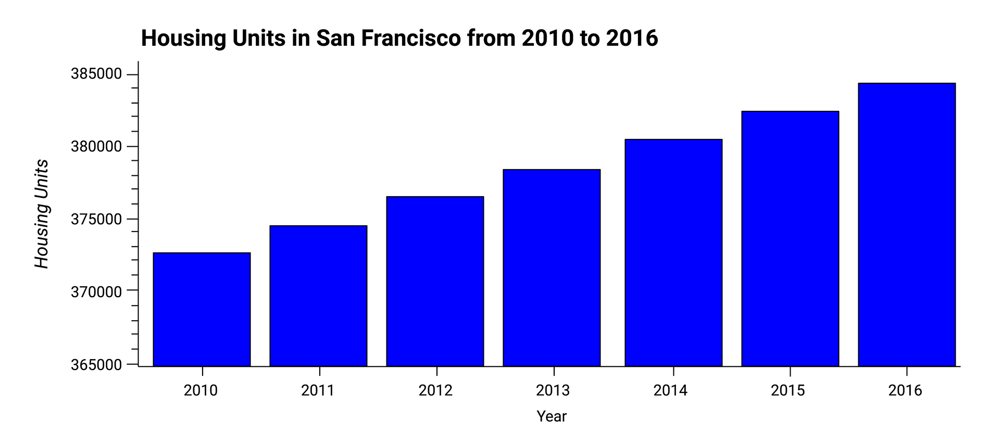

# Housing Rental Analysis for San Francisco

In this challenge, your job is to use your data visualisation skills, including aggregation, interactive visualisations, and geospatial analysis, to find properties in the San Francisco market that are viable investment opportunities.

### Instructions

Use the `san_francisco_housing.ipynb` notebook to visualise and analyse the real-estate data.

Note that this assignment requires you to create a visualisation by using hvPlot and GeoViews. Additionally, you need to read the `sfo_neighborhoods_census_data.csv` file from the `Resources` folder into the notebook and create the DataFrame that you’ll use in the analysis.

The main task in this Challenge is to visualise and analyse the real-estate data in your Jupyter notebook. Use the `san_francisco_housing.ipynb` notebook to complete the following tasks:

* Calculate and plot the housing units per year.

* Calculate and plot the average prices per square foot.

* Compare the average prices by neighbourhood.

* Build an interactive neighbourhood map.

* Compose your data story.

#### Calculate and Plot the Housing Units per Year

For this part of the assignment, use numerical and visual aggregation to calculate the number of housing units per year, and then visualise the results as a bar chart. To do so, complete the following steps:

1. Use the `groupby` function to group the data by year. Aggregate the results by the `mean` of the groups.

2. Use the `hvplot` function to plot the `housing_units_by_year` DataFrame as a bar chart. Make the x-axis represent the `year` and the y-axis represent the `housing_units`.

3. Style and format the line plot to ensure a professionally styled visualisation.

4. Note that your resulting plot should appear similar to the following image:

    

5. Answer the following question:

    * What’s the overall trend in housing units over the period that you’re analysing?

#### Calculate and Plot the Average Sale Prices per Square Foot

For this part of the assignment, use numerical and visual aggregation to calculate the average prices per square foot, and then visualise the results as a bar chart. To do so, complete the following steps:

1. Group the data by year, and then average the results. What’s the lowest gross rent that’s reported for the years that the DataFrame includes?

2. Create a new DataFrame named `prices_square_foot_by_year` by filtering out the “housing_units” column. The new DataFrame should include the averages per year for only the sale price per square foot and the gross rent.

3. Use hvPlot to plot the `prices_square_foot_by_year` DataFrame as a line plot.

    > **Hint** This single plot will include lines for both `sale_price_sqr_foot` and `gross_rent`.

4. Style and format the line plot to ensure a professionally styled visualisation.

5. Note that your resulting plot should appear similar to the following image:

    

6. Use both the `prices_square_foot_by_year` DataFrame and interactive plots to answer the following questions:

    * Did any year experience a drop in the average sale price per square foot compared to the previous year?

    * If so, did the gross rent increase or decrease during that year?

#### Compare the Average Sale Prices by Neighbourhood

For this part of the assignment, use interactive visualisations and widgets to explore the average sale price per square foot by neighbourhood. To do so, complete the following steps:

1. Create a new DataFrame that groups the original DataFrame by year and neighbourhood. Aggregate the results by the `mean` of the groups.

2. Filter out the “housing_units” column to create a DataFrame that includes only the `sale_price_sqr_foot` and `gross_rent` averages per year.

3. Create an interactive line plot with hvPlot that visualises both `sale_price_sqr_foot` and `gross_rent`. Set the x-axis parameter to the year (`x="year"`). Use the `groupby` parameter to create an interactive widget for `neighbourhood`.

4. Style and format the line plot to ensure a professionally styled visualisation.

5. Note that your resulting plot should appear similar to the following image:

    

6. Use the interactive visualisation to answer the following question:

    * For the Anza Vista neighbourhood, is the average sale price per square foot for 2016 more or less than the price that’s listed for 2012?

#### Build an Interactive Neighbourhood Map

For this part of the assignment, explore the geospatial relationships in the data by using interactive visualisations with hvPlot and GeoViews. To build your map, use the `sfo_data_df` DataFrame (created during the initial import), which includes the neighbourhood location data with the average prices. To do all this, complete the following steps:

1. Read the `neighbourhood_coordinates.csv` file from the `Resources` folder into the notebook, and create a DataFrame named `neighbourhood_locations_df`. Be sure to set the `index_col` of the DataFrame as “Neighbourhood”.

2. Using the original `sfo_data_df` Dataframe, create a DataFrame named `all_neighbourhood_info_df` that groups the data by neighbourhood. Aggregate the results by the `mean` of the group.

3. Review the two code cells that concatenate the `neighbourhood_locations_df` DataFrame with the `all_neighbourhood_info_df` DataFrame. Note that the first cell uses the [Pandas concat function](https://pandas.pydata.org/pandas-docs/stable/reference/api/pandas.concat.html) to create a DataFrame named `all_neighbourhoods_df`. The second cell cleans the data and sets the “Neighbourhood” column. Be sure to run these cells to create the `all_neighbourhoods_df` DataFrame, which you’ll need to create the geospatial visualisation.

4. Using hvPlot with GeoViews enabled, create a `points` plot for the `all_neighbourhoods_df` DataFrame. Be sure to do the following:

    * Set the `size` parameter to “sale_price_sqr_foot”.

    * Set the `color` parameter to “gross_rent”.

    * Set the `frame_width` parameter to 700.

    * Set the `frame_height` parameter to 500.

    * Include a descriptive title.

    Note that your resulting plot should appear similar to the following image:

    

5. Use the interactive map to answer the following question:

    * Which neighbourhood has the highest gross rent, and which has the highest sale price per square foot?

#### Compose Your Data Story

Based on the visualisations that you created, answer the following questions:

* How does the trend in rental income growth compare to the trend in sales prices? Does this same trend hold true for all the neighbourhoods across San Francisco?

* What insights can you share with your company about the potential one-click, buy-and-rent strategy that they're pursuing? Do neighbourhoods exist that you would suggest for investment, and why?


```python
# Import the required libraries and dependencies
import pandas as pd
import hvplot.pandas
from pathlib import Path
```


<style>.bk-root, .bk-root .bk:before, .bk-root .bk:after {
  font-family: var(--jp-ui-font-size1);
  font-size: var(--jp-ui-font-size1);
  color: var(--jp-ui-font-color1);
}
</style>


## Import the data 


```python
# Using the read_csv function and Path module, create a DataFrame 
# by importing the sfo_neighbourhoods_census_data.csv file from the Resources folder
sfo_data_df = pd.read_csv(Path('Resources/sfo_neighbourhoods_census_data.csv'))

# Review the first and last five rows of the DataFrame
display(sfo_data_df.head())
display(sfo_data_df.tail())
```


<div>
<style scoped>
    .dataframe tbody tr th:only-of-type {
        vertical-align: middle;
    }

    .dataframe tbody tr th {
        vertical-align: top;
    }

    .dataframe thead th {
        text-align: right;
    }
</style>
<table border="1" class="dataframe">
  <thead>
    <tr style="text-align: right;">
      <th></th>
      <th>year</th>
      <th>neighbourhood</th>
      <th>sale_price_sqr_foot</th>
      <th>housing_units</th>
      <th>gross_rent</th>
    </tr>
  </thead>
  <tbody>
    <tr>
      <th>0</th>
      <td>2010</td>
      <td>Alamo Square</td>
      <td>291.182945</td>
      <td>372560</td>
      <td>1239</td>
    </tr>
    <tr>
      <th>1</th>
      <td>2010</td>
      <td>Anza Vista</td>
      <td>267.932583</td>
      <td>372560</td>
      <td>1239</td>
    </tr>
    <tr>
      <th>2</th>
      <td>2010</td>
      <td>Bayview</td>
      <td>170.098665</td>
      <td>372560</td>
      <td>1239</td>
    </tr>
    <tr>
      <th>3</th>
      <td>2010</td>
      <td>Buena Vista Park</td>
      <td>347.394919</td>
      <td>372560</td>
      <td>1239</td>
    </tr>
    <tr>
      <th>4</th>
      <td>2010</td>
      <td>Central Richmond</td>
      <td>319.027623</td>
      <td>372560</td>
      <td>1239</td>
    </tr>
  </tbody>
</table>
</div>


<div>
<style scoped>
    .dataframe tbody tr th:only-of-type {
        vertical-align: middle;
    }

    .dataframe tbody tr th {
        vertical-align: top;
    }

    .dataframe thead th {
        text-align: right;
    }
</style>
<table border="1" class="dataframe">
  <thead>
    <tr style="text-align: right;">
      <th></th>
      <th>year</th>
      <th>neighbourhood</th>
      <th>sale_price_sqr_foot</th>
      <th>housing_units</th>
      <th>gross_rent</th>
    </tr>
  </thead>
  <tbody>
    <tr>
      <th>392</th>
      <td>2016</td>
      <td>Telegraph Hill</td>
      <td>903.049771</td>
      <td>384242</td>
      <td>4390</td>
    </tr>
    <tr>
      <th>393</th>
      <td>2016</td>
      <td>Twin Peaks</td>
      <td>970.085470</td>
      <td>384242</td>
      <td>4390</td>
    </tr>
    <tr>
      <th>394</th>
      <td>2016</td>
      <td>Van Ness/ Civic Center</td>
      <td>552.602567</td>
      <td>384242</td>
      <td>4390</td>
    </tr>
    <tr>
      <th>395</th>
      <td>2016</td>
      <td>Visitacion Valley</td>
      <td>328.319007</td>
      <td>384242</td>
      <td>4390</td>
    </tr>
    <tr>
      <th>396</th>
      <td>2016</td>
      <td>Westwood Park</td>
      <td>631.195426</td>
      <td>384242</td>
      <td>4390</td>
    </tr>
  </tbody>
</table>
</div>


---

## Calculate and Plot the Housing Units per Year

For this part of the assignment, use numerical and visual aggregation to calculate the number of housing units per year, and then visualise the results as a bar chart. To do so, complete the following steps:

1. Use the `groupby` function to group the data by year. Aggregate the results by the `mean` of the groups.

2. Use the `hvplot` function to plot the `housing_units_by_year` DataFrame as a bar chart. Make the x-axis represent the `year` and the y-axis represent the `housing_units`.

3. Style and format the line plot to ensure a professionally styled visualisation.

4. Note that your resulting plot should appear similar to the following image:

    

5. Answer the following question:

    * What’s the overall trend in housing units over the period that you’re analysing?

### Step 1: Use the `groupby` function to group the data by year. Aggregate the results by the `mean` of the groups.


```python
# Create a numerical aggregation that groups the data by the year and then averages the results.
housing_units_by_year = sfo_data_df.groupby('year').mean()

# Review the DataFrame
housing_units_by_year
```


<div>
<style scoped>
    .dataframe tbody tr th:only-of-type {
        vertical-align: middle;
    }

    .dataframe tbody tr th {
        vertical-align: top;
    }

    .dataframe thead th {
        text-align: right;
    }
</style>
<table border="1" class="dataframe">
  <thead>
    <tr style="text-align: right;">
      <th></th>
      <th>sale_price_sqr_foot</th>
      <th>housing_units</th>
      <th>gross_rent</th>
    </tr>
    <tr>
      <th>year</th>
      <th></th>
      <th></th>
      <th></th>
    </tr>
  </thead>
  <tbody>
    <tr>
      <th>2010</th>
      <td>369.344353</td>
      <td>372560.0</td>
      <td>1239.0</td>
    </tr>
    <tr>
      <th>2011</th>
      <td>341.903429</td>
      <td>374507.0</td>
      <td>1530.0</td>
    </tr>
    <tr>
      <th>2012</th>
      <td>399.389968</td>
      <td>376454.0</td>
      <td>2324.0</td>
    </tr>
    <tr>
      <th>2013</th>
      <td>483.600304</td>
      <td>378401.0</td>
      <td>2971.0</td>
    </tr>
    <tr>
      <th>2014</th>
      <td>556.277273</td>
      <td>380348.0</td>
      <td>3528.0</td>
    </tr>
    <tr>
      <th>2015</th>
      <td>632.540352</td>
      <td>382295.0</td>
      <td>3739.0</td>
    </tr>
    <tr>
      <th>2016</th>
      <td>697.643709</td>
      <td>384242.0</td>
      <td>4390.0</td>
    </tr>
  </tbody>
</table>
</div>


### Step 2: Use the `hvplot` function to plot the `housing_units_by_year` DataFrame as a bar chart. Make the x-axis represent the `year` and the y-axis represent the `housing_units`.

### Step 3: Style and format the line plot to ensure a professionally styled visualisation.


```python
# Create a visual aggregation explore the housing units by year
housing_units_by_year.hvplot.bar(
    color='blue', y='housing_units',
    ylabel='Housing Units', xlabel='Year',
    width=900, height=400,
    ylim=(365000, 385999),
    label = 'Housing units in San Fransisco from 2010 to 2016'
).opts(
    yformatter='%.0f',
    fontsize={
    'title': 16, 
    'labels': 14,
    'xticks': 11, 
    'yticks': 11,
    }
)
```


<div id='1002'>
  <div class="bk-root" id="a99098ca-a71f-4a95-9295-3f706bf6f85c" data-root-id="1002"></div>
</div>
<script type="application/javascript">(function(root) {
  function embed_document(root) {
    var docs_json = {"69a9ba22-cb96-43f5-abe3-944693186a67":{"defs":[{"extends":null,"module":null,"name":"ReactiveHTML1","overrides":[],"properties":[]},{"extends":null,"module":null,"name":"FlexBox1","overrides":[],"properties":[{"default":"flex-start","kind":null,"name":"align_content"},{"default":"flex-start","kind":null,"name":"align_items"},{"default":"row","kind":null,"name":"flex_direction"},{"default":"wrap","kind":null,"name":"flex_wrap"},{"default":"flex-start","kind":null,"name":"justify_content"}]},{"extends":null,"module":null,"name":"GridStack1","overrides":[],"properties":[{"default":"warn","kind":null,"name":"mode"},{"default":null,"kind":null,"name":"ncols"},{"default":null,"kind":null,"name":"nrows"},{"default":true,"kind":null,"name":"allow_resize"},{"default":true,"kind":null,"name":"allow_drag"},{"default":[],"kind":null,"name":"state"}]},{"extends":null,"module":null,"name":"click1","overrides":[],"properties":[{"default":"","kind":null,"name":"terminal_output"},{"default":"","kind":null,"name":"debug_name"},{"default":0,"kind":null,"name":"clears"}]},{"extends":null,"module":null,"name":"NotificationAreaBase1","overrides":[],"properties":[{"default":"bottom-right","kind":null,"name":"position"},{"default":0,"kind":null,"name":"_clear"}]},{"extends":null,"module":null,"name":"NotificationArea1","overrides":[],"properties":[{"default":[],"kind":null,"name":"notifications"},{"default":"bottom-right","kind":null,"name":"position"},{"default":0,"kind":null,"name":"_clear"},{"default":[{"background":"#ffc107","icon":{"className":"fas fa-exclamation-triangle","color":"white","tagName":"i"},"type":"warning"},{"background":"#007bff","icon":{"className":"fas fa-info-circle","color":"white","tagName":"i"},"type":"info"}],"kind":null,"name":"types"}]},{"extends":null,"module":null,"name":"Notification","overrides":[],"properties":[{"default":null,"kind":null,"name":"background"},{"default":3000,"kind":null,"name":"duration"},{"default":null,"kind":null,"name":"icon"},{"default":"","kind":null,"name":"message"},{"default":null,"kind":null,"name":"notification_type"},{"default":false,"kind":null,"name":"_destroyed"}]},{"extends":null,"module":null,"name":"TemplateActions1","overrides":[],"properties":[{"default":0,"kind":null,"name":"open_modal"},{"default":0,"kind":null,"name":"close_modal"}]},{"extends":null,"module":null,"name":"MaterialTemplateActions1","overrides":[],"properties":[{"default":0,"kind":null,"name":"open_modal"},{"default":0,"kind":null,"name":"close_modal"}]}],"roots":{"references":[{"attributes":{},"id":"1023","type":"SaveTool"},{"attributes":{},"id":"1024","type":"PanTool"},{"attributes":{},"id":"1025","type":"WheelZoomTool"},{"attributes":{"margin":[5,5,5,5],"name":"HSpacer00886","sizing_mode":"stretch_width"},"id":"1063","type":"Spacer"},{"attributes":{"overlay":{"id":"1028"}},"id":"1026","type":"BoxZoomTool"},{"attributes":{"format":"%.0f"},"id":"1045","type":"PrintfTickFormatter"},{"attributes":{},"id":"1027","type":"ResetTool"},{"attributes":{"bottom_units":"screen","coordinates":null,"fill_alpha":0.5,"fill_color":"lightgrey","group":null,"left_units":"screen","level":"overlay","line_alpha":1.0,"line_color":"black","line_dash":[4,4],"line_width":2,"right_units":"screen","syncable":false,"top_units":"screen"},"id":"1028","type":"BoxAnnotation"},{"attributes":{"source":{"id":"1036"}},"id":"1043","type":"CDSView"},{"attributes":{"fill_color":{"value":"blue"},"hatch_color":{"value":"blue"},"top":{"field":"housing_units"},"width":{"value":0.8},"x":{"field":"year"}},"id":"1039","type":"VBar"},{"attributes":{},"id":"1012","type":"CategoricalScale"},{"attributes":{"margin":[5,5,5,5],"name":"HSpacer00885","sizing_mode":"stretch_width"},"id":"1003","type":"Spacer"},{"attributes":{"tools":[{"id":"1006"},{"id":"1023"},{"id":"1024"},{"id":"1025"},{"id":"1026"},{"id":"1027"}]},"id":"1029","type":"Toolbar"},{"attributes":{"factors":["2010","2011","2012","2013","2014","2015","2016"],"tags":[[["year","year",null]]]},"id":"1004","type":"FactorRange"},{"attributes":{},"id":"1020","type":"BasicTicker"},{"attributes":{"coordinates":null,"group":null,"text":"Housing units in San Fransisco from 2010 to 2016","text_color":"black","text_font_size":"16pt"},"id":"1008","type":"Title"},{"attributes":{},"id":"1048","type":"AllLabels"},{"attributes":{},"id":"1014","type":"LinearScale"},{"attributes":{"callback":null,"renderers":[{"id":"1042"}],"tags":["hv_created"],"tooltips":[["year","@{year}"],["housing_units","@{housing_units}"]]},"id":"1006","type":"HoverTool"},{"attributes":{},"id":"1037","type":"Selection"},{"attributes":{"children":[{"id":"1003"},{"id":"1007"},{"id":"1063"}],"margin":[0,0,0,0],"name":"Row00881","tags":["embedded"]},"id":"1002","type":"Row"},{"attributes":{"fill_alpha":{"value":0.1},"fill_color":{"value":"blue"},"hatch_alpha":{"value":0.1},"hatch_color":{"value":"blue"},"line_alpha":{"value":0.1},"top":{"field":"housing_units"},"width":{"value":0.8},"x":{"field":"year"}},"id":"1040","type":"VBar"},{"attributes":{"end":385999,"reset_end":385999,"reset_start":365000,"start":365000,"tags":[[["housing_units","housing_units",null]]]},"id":"1005","type":"Range1d"},{"attributes":{},"id":"1060","type":"UnionRenderers"},{"attributes":{},"id":"1047","type":"CategoricalTickFormatter"},{"attributes":{"below":[{"id":"1016"}],"center":[{"id":"1018"},{"id":"1022"}],"height":400,"left":[{"id":"1019"}],"margin":[5,5,5,5],"min_border_bottom":10,"min_border_left":10,"min_border_right":10,"min_border_top":10,"renderers":[{"id":"1042"}],"sizing_mode":"fixed","title":{"id":"1008"},"toolbar":{"id":"1029"},"width":900,"x_range":{"id":"1004"},"x_scale":{"id":"1012"},"y_range":{"id":"1005"},"y_scale":{"id":"1014"}},"id":"1007","subtype":"Figure","type":"Plot"},{"attributes":{"axis":{"id":"1016"},"coordinates":null,"grid_line_color":null,"group":null,"ticker":null},"id":"1018","type":"Grid"},{"attributes":{"axis_label":"Year","axis_label_text_font_size":"14pt","coordinates":null,"formatter":{"id":"1047"},"group":null,"group_text_font_size":"11pt","major_label_policy":{"id":"1048"},"major_label_text_font_size":"11pt","ticker":{"id":"1017"}},"id":"1016","type":"CategoricalAxis"},{"attributes":{},"id":"1051","type":"AllLabels"},{"attributes":{"data":{"housing_units":{"__ndarray__":"AAAAAEC9FkEAAAAArNsWQQAAAAAY+hZBAAAAAIQYF0EAAAAA8DYXQQAAAABcVRdBAAAAAMhzF0E=","dtype":"float64","order":"little","shape":[7]},"year":["2010","2011","2012","2013","2014","2015","2016"]},"selected":{"id":"1037"},"selection_policy":{"id":"1060"}},"id":"1036","type":"ColumnDataSource"},{"attributes":{"bottom":{"value":0},"fill_alpha":{"value":1.0},"fill_color":{"value":"blue"},"hatch_alpha":{"value":1.0},"hatch_color":{"value":"blue"},"hatch_scale":{"value":12.0},"hatch_weight":{"value":1.0},"line_alpha":{"value":1.0},"line_cap":{"value":"butt"},"line_color":{"value":"black"},"line_dash":{"value":[]},"line_dash_offset":{"value":0},"line_join":{"value":"bevel"},"line_width":{"value":1},"top":{"field":"housing_units"},"width":{"value":0.8},"x":{"field":"year"}},"id":"1044","type":"VBar"},{"attributes":{},"id":"1017","type":"CategoricalTicker"},{"attributes":{"axis_label":"Housing Units","axis_label_text_font_size":"14pt","coordinates":null,"formatter":{"id":"1045"},"group":null,"major_label_policy":{"id":"1051"},"major_label_text_font_size":"11pt","ticker":{"id":"1020"}},"id":"1019","type":"LinearAxis"},{"attributes":{"axis":{"id":"1019"},"coordinates":null,"dimension":1,"grid_line_color":null,"group":null,"ticker":null},"id":"1022","type":"Grid"},{"attributes":{"fill_alpha":{"value":0.2},"fill_color":{"value":"blue"},"hatch_alpha":{"value":0.2},"hatch_color":{"value":"blue"},"line_alpha":{"value":0.2},"top":{"field":"housing_units"},"width":{"value":0.8},"x":{"field":"year"}},"id":"1041","type":"VBar"},{"attributes":{"coordinates":null,"data_source":{"id":"1036"},"glyph":{"id":"1039"},"group":null,"hover_glyph":null,"muted_glyph":{"id":"1041"},"nonselection_glyph":{"id":"1040"},"selection_glyph":{"id":"1044"},"view":{"id":"1043"}},"id":"1042","type":"GlyphRenderer"}],"root_ids":["1002"]},"title":"Bokeh Application","version":"2.4.3"}};
    var render_items = [{"docid":"69a9ba22-cb96-43f5-abe3-944693186a67","root_ids":["1002"],"roots":{"1002":"a99098ca-a71f-4a95-9295-3f706bf6f85c"}}];
    root.Bokeh.embed.embed_items_notebook(docs_json, render_items);
  }
  if (root.Bokeh !== undefined && root.Bokeh.Panel !== undefined) {
    embed_document(root);
  } else {
    var attempts = 0;
    var timer = setInterval(function(root) {
      if (root.Bokeh !== undefined && root.Bokeh.Panel !== undefined) {
        clearInterval(timer);
        embed_document(root);
      } else if (document.readyState == "complete") {
        attempts++;
        if (attempts > 200) {
          clearInterval(timer);
          console.log("Bokeh: ERROR: Unable to run BokehJS code because BokehJS library is missing");
        }
      }
    }, 25, root)
  }
})(window);</script>


### Step 5: Answer the following question:

**Question:** What is the overall trend in housing_units over the period being analysed?

**Answer:** Housing units trend has increased every year throughout the 2010 to 2016 period.

---

## Calculate and Plot the Average Sale Prices per Square Foot

For this part of the assignment, use numerical and visual aggregation to calculate the average prices per square foot, and then visualise the results as a bar chart. To do so, complete the following steps:

1. Group the data by year, and then average the results. What’s the lowest gross rent that’s reported for the years that the DataFrame includes?

2. Create a new DataFrame named `prices_square_foot_by_year` by filtering out the “housing_units” column. The new DataFrame should include the averages per year for only the sale price per square foot and the gross rent.

3. Use hvPlot to plot the `prices_square_foot_by_year` DataFrame as a line plot.

    > **Hint** This single plot will include lines for both `sale_price_sqr_foot` and `gross_rent`.

4. Style and format the line plot to ensure a professionally styled visualisation.

5. Note that your resulting plot should appear similar to the following image:

    

6. Use both the `prices_square_foot_by_year` DataFrame and interactive plots to answer the following questions:

    * Did any year experience a drop in the average sale price per square foot compared to the previous year?

    * If so, did the gross rent increase or decrease during that year?

### Step 1: Group the data by year, and then average the results.


```python
# Create a numerical aggregation by grouping the data by year and averaging the results
prices_square_foot_by_year = sfo_data_df.groupby('year').mean()

# Review the resulting DataFrame
prices_square_foot_by_year
```


<div>
<style scoped>
    .dataframe tbody tr th:only-of-type {
        vertical-align: middle;
    }

    .dataframe tbody tr th {
        vertical-align: top;
    }

    .dataframe thead th {
        text-align: right;
    }
</style>
<table border="1" class="dataframe">
  <thead>
    <tr style="text-align: right;">
      <th></th>
      <th>sale_price_sqr_foot</th>
      <th>housing_units</th>
      <th>gross_rent</th>
    </tr>
    <tr>
      <th>year</th>
      <th></th>
      <th></th>
      <th></th>
    </tr>
  </thead>
  <tbody>
    <tr>
      <th>2010</th>
      <td>369.344353</td>
      <td>372560.0</td>
      <td>1239.0</td>
    </tr>
    <tr>
      <th>2011</th>
      <td>341.903429</td>
      <td>374507.0</td>
      <td>1530.0</td>
    </tr>
    <tr>
      <th>2012</th>
      <td>399.389968</td>
      <td>376454.0</td>
      <td>2324.0</td>
    </tr>
    <tr>
      <th>2013</th>
      <td>483.600304</td>
      <td>378401.0</td>
      <td>2971.0</td>
    </tr>
    <tr>
      <th>2014</th>
      <td>556.277273</td>
      <td>380348.0</td>
      <td>3528.0</td>
    </tr>
    <tr>
      <th>2015</th>
      <td>632.540352</td>
      <td>382295.0</td>
      <td>3739.0</td>
    </tr>
    <tr>
      <th>2016</th>
      <td>697.643709</td>
      <td>384242.0</td>
      <td>4390.0</td>
    </tr>
  </tbody>
</table>
</div>


**Question:** What is the lowest gross rent reported for the years included in the DataFrame?

**Answer:** The lowest gross rent reported in 2010th year: 1239.0

### Step 2: Create a new DataFrame named `prices_square_foot_by_year` by filtering out the “housing_units” column. The new DataFrame should include the averages per year for only the sale price per square foot and the gross rent.


```python
# Filter out the housing_units column, creating a new DataFrame 
# Keep only sale_price_sqr_foot and gross_rent averages per year
prices_square_foot_by_year.drop(columns='housing_units', axis=1, inplace=True)

# Review the DataFrame
prices_square_foot_by_year
```


<div>
<style scoped>
    .dataframe tbody tr th:only-of-type {
        vertical-align: middle;
    }

    .dataframe tbody tr th {
        vertical-align: top;
    }

    .dataframe thead th {
        text-align: right;
    }
</style>
<table border="1" class="dataframe">
  <thead>
    <tr style="text-align: right;">
      <th></th>
      <th>sale_price_sqr_foot</th>
      <th>gross_rent</th>
    </tr>
    <tr>
      <th>year</th>
      <th></th>
      <th></th>
    </tr>
  </thead>
  <tbody>
    <tr>
      <th>2010</th>
      <td>369.344353</td>
      <td>1239.0</td>
    </tr>
    <tr>
      <th>2011</th>
      <td>341.903429</td>
      <td>1530.0</td>
    </tr>
    <tr>
      <th>2012</th>
      <td>399.389968</td>
      <td>2324.0</td>
    </tr>
    <tr>
      <th>2013</th>
      <td>483.600304</td>
      <td>2971.0</td>
    </tr>
    <tr>
      <th>2014</th>
      <td>556.277273</td>
      <td>3528.0</td>
    </tr>
    <tr>
      <th>2015</th>
      <td>632.540352</td>
      <td>3739.0</td>
    </tr>
    <tr>
      <th>2016</th>
      <td>697.643709</td>
      <td>4390.0</td>
    </tr>
  </tbody>
</table>
</div>


### Step 3: Use hvPlot to plot the `prices_square_foot_by_year` DataFrame as a line plot.

> **Hint** This single plot will include lines for both `sale_price_sqr_foot` and `gross_rent`

### Step 4: Style and format the line plot to ensure a professionally styled visualisation.


```python
# Plot prices_square_foot_by_year. 
# Inclued labels for the x- and y-axes, and a title.
prices_square_foot_by_year.hvplot.line(
    y=['sale_price_sqr_foot', 'gross_rent'],
    ylabel='Gross Rent/Sale Price Per Square Foot',
    xlabel='Year',
    ylim=(0, 4700),
    width=950, height=400,
    title = 'Sale Price Per Square Foot and Average Gross Rent - 2010 to 2016 - San Fransisco'
).opts(
    fontsize={
    'title': 15, 
    'labels': 14,
    'xticks': 11, 
    'yticks': 11,
    },
    legend_position='right'
)
```


<div id='1110'>
  <div class="bk-root" id="2d0dde0d-b406-4b30-afbd-a738c927bdc7" data-root-id="1110"></div>
</div>
<script type="application/javascript">(function(root) {
  function embed_document(root) {
    var docs_json = {"21217a19-07ce-41f1-8724-cf8fc11205fc":{"defs":[{"extends":null,"module":null,"name":"ReactiveHTML1","overrides":[],"properties":[]},{"extends":null,"module":null,"name":"FlexBox1","overrides":[],"properties":[{"default":"flex-start","kind":null,"name":"align_content"},{"default":"flex-start","kind":null,"name":"align_items"},{"default":"row","kind":null,"name":"flex_direction"},{"default":"wrap","kind":null,"name":"flex_wrap"},{"default":"flex-start","kind":null,"name":"justify_content"}]},{"extends":null,"module":null,"name":"GridStack1","overrides":[],"properties":[{"default":"warn","kind":null,"name":"mode"},{"default":null,"kind":null,"name":"ncols"},{"default":null,"kind":null,"name":"nrows"},{"default":true,"kind":null,"name":"allow_resize"},{"default":true,"kind":null,"name":"allow_drag"},{"default":[],"kind":null,"name":"state"}]},{"extends":null,"module":null,"name":"click1","overrides":[],"properties":[{"default":"","kind":null,"name":"terminal_output"},{"default":"","kind":null,"name":"debug_name"},{"default":0,"kind":null,"name":"clears"}]},{"extends":null,"module":null,"name":"NotificationAreaBase1","overrides":[],"properties":[{"default":"bottom-right","kind":null,"name":"position"},{"default":0,"kind":null,"name":"_clear"}]},{"extends":null,"module":null,"name":"NotificationArea1","overrides":[],"properties":[{"default":[],"kind":null,"name":"notifications"},{"default":"bottom-right","kind":null,"name":"position"},{"default":0,"kind":null,"name":"_clear"},{"default":[{"background":"#ffc107","icon":{"className":"fas fa-exclamation-triangle","color":"white","tagName":"i"},"type":"warning"},{"background":"#007bff","icon":{"className":"fas fa-info-circle","color":"white","tagName":"i"},"type":"info"}],"kind":null,"name":"types"}]},{"extends":null,"module":null,"name":"Notification","overrides":[],"properties":[{"default":null,"kind":null,"name":"background"},{"default":3000,"kind":null,"name":"duration"},{"default":null,"kind":null,"name":"icon"},{"default":"","kind":null,"name":"message"},{"default":null,"kind":null,"name":"notification_type"},{"default":false,"kind":null,"name":"_destroyed"}]},{"extends":null,"module":null,"name":"TemplateActions1","overrides":[],"properties":[{"default":0,"kind":null,"name":"open_modal"},{"default":0,"kind":null,"name":"close_modal"}]},{"extends":null,"module":null,"name":"MaterialTemplateActions1","overrides":[],"properties":[{"default":0,"kind":null,"name":"open_modal"},{"default":0,"kind":null,"name":"close_modal"}]}],"roots":{"references":[{"attributes":{},"id":"1126","type":"BasicTicker"},{"attributes":{"line_alpha":0.1,"line_color":"#30a2da","line_width":2,"x":{"field":"year"},"y":{"field":"value"}},"id":"1156","type":"Line"},{"attributes":{"label":{"value":"gross_rent"},"renderers":[{"id":"1179"}]},"id":"1193","type":"LegendItem"},{"attributes":{"axis_label":"Gross Rent/Sale Price Per Square Foot","axis_label_text_font_size":"14pt","coordinates":null,"formatter":{"id":"1150"},"group":null,"major_label_policy":{"id":"1151"},"major_label_text_font_size":"11pt","ticker":{"id":"1130"}},"id":"1129","type":"LinearAxis"},{"attributes":{"line_color":"#fc4f30","line_width":2,"x":{"field":"year"},"y":{"field":"value"}},"id":"1176","type":"Line"},{"attributes":{},"id":"1147","type":"BasicTickFormatter"},{"attributes":{"axis":{"id":"1129"},"coordinates":null,"dimension":1,"grid_line_color":null,"group":null,"ticker":null},"id":"1132","type":"Grid"},{"attributes":{},"id":"1130","type":"BasicTicker"},{"attributes":{"source":{"id":"1173"}},"id":"1180","type":"CDSView"},{"attributes":{},"id":"1135","type":"WheelZoomTool"},{"attributes":{},"id":"1190","type":"UnionRenderers"},{"attributes":{},"id":"1174","type":"Selection"},{"attributes":{},"id":"1148","type":"AllLabels"},{"attributes":{"coordinates":null,"data_source":{"id":"1173"},"glyph":{"id":"1176"},"group":null,"hover_glyph":null,"muted_glyph":{"id":"1178"},"nonselection_glyph":{"id":"1177"},"selection_glyph":{"id":"1194"},"view":{"id":"1180"}},"id":"1179","type":"GlyphRenderer"},{"attributes":{},"id":"1150","type":"BasicTickFormatter"},{"attributes":{},"id":"1133","type":"SaveTool"},{"attributes":{"overlay":{"id":"1138"}},"id":"1136","type":"BoxZoomTool"},{"attributes":{"line_color":"#30a2da","line_width":2,"x":{"field":"year"},"y":{"field":"value"}},"id":"1172","type":"Line"},{"attributes":{"margin":[5,5,5,5],"name":"HSpacer01025","sizing_mode":"stretch_width"},"id":"1207","type":"Spacer"},{"attributes":{"line_alpha":0.2,"line_color":"#fc4f30","line_width":2,"x":{"field":"year"},"y":{"field":"value"}},"id":"1178","type":"Line"},{"attributes":{},"id":"1137","type":"ResetTool"},{"attributes":{"label":{"value":"sale_price_sqr_foot"},"renderers":[{"id":"1158"}]},"id":"1171","type":"LegendItem"},{"attributes":{"bottom_units":"screen","coordinates":null,"fill_alpha":0.5,"fill_color":"lightgrey","group":null,"left_units":"screen","level":"overlay","line_alpha":1.0,"line_color":"black","line_dash":[4,4],"line_width":2,"right_units":"screen","syncable":false,"top_units":"screen"},"id":"1138","type":"BoxAnnotation"},{"attributes":{},"id":"1151","type":"AllLabels"},{"attributes":{"end":4700,"reset_end":4700,"reset_start":0,"tags":[[["value","value",null]]]},"id":"1113","type":"Range1d"},{"attributes":{"line_color":"#30a2da","line_width":2,"x":{"field":"year"},"y":{"field":"value"}},"id":"1155","type":"Line"},{"attributes":{"line_alpha":0.1,"line_color":"#fc4f30","line_width":2,"x":{"field":"year"},"y":{"field":"value"}},"id":"1177","type":"Line"},{"attributes":{"source":{"id":"1152"}},"id":"1159","type":"CDSView"},{"attributes":{"tools":[{"id":"1114"},{"id":"1133"},{"id":"1134"},{"id":"1135"},{"id":"1136"},{"id":"1137"}]},"id":"1139","type":"Toolbar"},{"attributes":{},"id":"1167","type":"UnionRenderers"},{"attributes":{"end":2016.0,"reset_end":2016.0,"reset_start":2010.0,"start":2010.0,"tags":[[["year","year",null]]]},"id":"1112","type":"Range1d"},{"attributes":{},"id":"1153","type":"Selection"},{"attributes":{},"id":"1121","type":"LinearScale"},{"attributes":{"line_alpha":0.2,"line_color":"#30a2da","line_width":2,"x":{"field":"year"},"y":{"field":"value"}},"id":"1157","type":"Line"},{"attributes":{"coordinates":null,"data_source":{"id":"1152"},"glyph":{"id":"1155"},"group":null,"hover_glyph":null,"muted_glyph":{"id":"1157"},"nonselection_glyph":{"id":"1156"},"selection_glyph":{"id":"1172"},"view":{"id":"1159"}},"id":"1158","type":"GlyphRenderer"},{"attributes":{"callback":null,"renderers":[{"id":"1158"},{"id":"1179"}],"tags":["hv_created"],"tooltips":[["Variable","@{Variable}"],["year","@{year}"],["value","@{value}"]]},"id":"1114","type":"HoverTool"},{"attributes":{"click_policy":"mute","coordinates":null,"group":null,"items":[{"id":"1171"},{"id":"1193"}],"location":[0,0],"title":"Variable"},"id":"1170","type":"Legend"},{"attributes":{"below":[{"id":"1125"}],"center":[{"id":"1128"},{"id":"1132"}],"height":400,"left":[{"id":"1129"}],"margin":[5,5,5,5],"min_border_bottom":10,"min_border_left":10,"min_border_right":10,"min_border_top":10,"renderers":[{"id":"1158"},{"id":"1179"}],"right":[{"id":"1170"}],"sizing_mode":"fixed","title":{"id":"1117"},"toolbar":{"id":"1139"},"width":950,"x_range":{"id":"1112"},"x_scale":{"id":"1121"},"y_range":{"id":"1113"},"y_scale":{"id":"1123"}},"id":"1116","subtype":"Figure","type":"Plot"},{"attributes":{"margin":[5,5,5,5],"name":"HSpacer01024","sizing_mode":"stretch_width"},"id":"1111","type":"Spacer"},{"attributes":{"data":{"Variable":["sale_price_sqr_foot","sale_price_sqr_foot","sale_price_sqr_foot","sale_price_sqr_foot","sale_price_sqr_foot","sale_price_sqr_foot","sale_price_sqr_foot"],"value":{"__ndarray__":"tgKjeIIVd0Dn7CdydF51QGhijk899nhAZhKk2Jo5fkDGKCTbN2KBQPMTFqRSxINATx33UCbNhUA=","dtype":"float64","order":"little","shape":[7]},"year":[2010,2011,2012,2013,2014,2015,2016]},"selected":{"id":"1153"},"selection_policy":{"id":"1167"}},"id":"1152","type":"ColumnDataSource"},{"attributes":{"children":[{"id":"1111"},{"id":"1116"},{"id":"1207"}],"margin":[0,0,0,0],"name":"Row01020","tags":["embedded"]},"id":"1110","type":"Row"},{"attributes":{"coordinates":null,"group":null,"text":"Sale Price Per Square Foot and Average Gross Rent - 2010 to 2016 - San Fransisco","text_color":"black","text_font_size":"15pt"},"id":"1117","type":"Title"},{"attributes":{"line_color":"#fc4f30","line_width":2,"x":{"field":"year"},"y":{"field":"value"}},"id":"1194","type":"Line"},{"attributes":{"data":{"Variable":["gross_rent","gross_rent","gross_rent","gross_rent","gross_rent","gross_rent","gross_rent"],"value":{"__ndarray__":"AAAAAABck0AAAAAAAOiXQAAAAAAAKKJAAAAAAAA2p0AAAAAAAJCrQAAAAAAANq1AAAAAAAAmsUA=","dtype":"float64","order":"little","shape":[7]},"year":[2010,2011,2012,2013,2014,2015,2016]},"selected":{"id":"1174"},"selection_policy":{"id":"1190"}},"id":"1173","type":"ColumnDataSource"},{"attributes":{},"id":"1134","type":"PanTool"},{"attributes":{"axis":{"id":"1125"},"coordinates":null,"grid_line_color":null,"group":null,"ticker":null},"id":"1128","type":"Grid"},{"attributes":{"axis_label":"Year","axis_label_text_font_size":"14pt","coordinates":null,"formatter":{"id":"1147"},"group":null,"major_label_policy":{"id":"1148"},"major_label_text_font_size":"11pt","ticker":{"id":"1126"}},"id":"1125","type":"LinearAxis"},{"attributes":{},"id":"1123","type":"LinearScale"}],"root_ids":["1110"]},"title":"Bokeh Application","version":"2.4.3"}};
    var render_items = [{"docid":"21217a19-07ce-41f1-8724-cf8fc11205fc","root_ids":["1110"],"roots":{"1110":"2d0dde0d-b406-4b30-afbd-a738c927bdc7"}}];
    root.Bokeh.embed.embed_items_notebook(docs_json, render_items);
  }
  if (root.Bokeh !== undefined && root.Bokeh.Panel !== undefined) {
    embed_document(root);
  } else {
    var attempts = 0;
    var timer = setInterval(function(root) {
      if (root.Bokeh !== undefined && root.Bokeh.Panel !== undefined) {
        clearInterval(timer);
        embed_document(root);
      } else if (document.readyState == "complete") {
        attempts++;
        if (attempts > 200) {
          clearInterval(timer);
          console.log("Bokeh: ERROR: Unable to run BokehJS code because BokehJS library is missing");
        }
      }
    }, 25, root)
  }
})(window);</script>


### Step 6: Use both the `prices_square_foot_by_year` DataFrame and interactive plots to answer the following questions:

**Question:** Did any year experience a drop in the average sale price per square foot compared to the previous year?

**Answer:** 2011th had a decrease in average sale price per square foot

**Question:** If so, did the gross rent increase or decrease during that year?

**Answer:** The gross rent increased that year

---

## Compare the Average Sale Prices by Neighbourhood

For this part of the assignment, use interactive visualisations and widgets to explore the average sale price per square foot by neighbourhood. To do so, complete the following steps:

1. Create a new DataFrame that groups the original DataFrame by year and neighbourhood. Aggregate the results by the `mean` of the groups.

2. Filter out the “housing_units” column to create a DataFrame that includes only the `sale_price_sqr_foot` and `gross_rent` averages per year.

3. Create an interactive line plot with hvPlot that visualises both `sale_price_sqr_foot` and `gross_rent`. Set the x-axis parameter to the year (`x="year"`). Use the `groupby` parameter to create an interactive widget for `neighbourhood`.

4. Style and format the line plot to ensure a professionally styled visualisation.

5. Note that your resulting plot should appear similar to the following image:

    

6. Use the interactive visualisation to answer the following question:

    * For the Anza Vista neighbourhood, is the average sale price per square foot for 2016 more or less than the price that’s listed for 2012?


### Step 1: Create a new DataFrame that groups the original DataFrame by year and neighbourhood. Aggregate the results by the `mean` of the groups.


```python
# Group by year and neighbourhood and then create a new dataframe of the mean values
prices_by_year_by_neighbourhood = sfo_data_df.groupby(['year','neighbourhood']).mean()

# Review the DataFrame
prices_by_year_by_neighbourhood
```


<div>
<style scoped>
    .dataframe tbody tr th:only-of-type {
        vertical-align: middle;
    }

    .dataframe tbody tr th {
        vertical-align: top;
    }

    .dataframe thead th {
        text-align: right;
    }
</style>
<table border="1" class="dataframe">
  <thead>
    <tr style="text-align: right;">
      <th></th>
      <th></th>
      <th>sale_price_sqr_foot</th>
      <th>housing_units</th>
      <th>gross_rent</th>
    </tr>
    <tr>
      <th>year</th>
      <th>neighbourhood</th>
      <th></th>
      <th></th>
      <th></th>
    </tr>
  </thead>
  <tbody>
    <tr>
      <th rowspan="5" valign="top">2010</th>
      <th>Alamo Square</th>
      <td>291.182945</td>
      <td>372560.0</td>
      <td>1239.0</td>
    </tr>
    <tr>
      <th>Anza Vista</th>
      <td>267.932583</td>
      <td>372560.0</td>
      <td>1239.0</td>
    </tr>
    <tr>
      <th>Bayview</th>
      <td>170.098665</td>
      <td>372560.0</td>
      <td>1239.0</td>
    </tr>
    <tr>
      <th>Buena Vista Park</th>
      <td>347.394919</td>
      <td>372560.0</td>
      <td>1239.0</td>
    </tr>
    <tr>
      <th>Central Richmond</th>
      <td>319.027623</td>
      <td>372560.0</td>
      <td>1239.0</td>
    </tr>
    <tr>
      <th>...</th>
      <th>...</th>
      <td>...</td>
      <td>...</td>
      <td>...</td>
    </tr>
    <tr>
      <th rowspan="5" valign="top">2016</th>
      <th>Telegraph Hill</th>
      <td>903.049771</td>
      <td>384242.0</td>
      <td>4390.0</td>
    </tr>
    <tr>
      <th>Twin Peaks</th>
      <td>970.085470</td>
      <td>384242.0</td>
      <td>4390.0</td>
    </tr>
    <tr>
      <th>Van Ness/ Civic Center</th>
      <td>552.602567</td>
      <td>384242.0</td>
      <td>4390.0</td>
    </tr>
    <tr>
      <th>Visitacion Valley</th>
      <td>328.319007</td>
      <td>384242.0</td>
      <td>4390.0</td>
    </tr>
    <tr>
      <th>Westwood Park</th>
      <td>631.195426</td>
      <td>384242.0</td>
      <td>4390.0</td>
    </tr>
  </tbody>
</table>
<p>397 rows × 3 columns</p>
</div>


### Step 2: Filter out the “housing_units” column to create a DataFrame that includes only the `sale_price_sqr_foot` and `gross_rent` averages per year.


```python
# Filter out the housing_units
prices_by_year_by_neighbourhood.drop(columns='housing_units', inplace=True)

# Review the first and last five rows of the DataFrame
display(prices_by_year_by_neighbourhood.head())
display(prices_by_year_by_neighbourhood.tail())
```


<div>
<style scoped>
    .dataframe tbody tr th:only-of-type {
        vertical-align: middle;
    }

    .dataframe tbody tr th {
        vertical-align: top;
    }

    .dataframe thead th {
        text-align: right;
    }
</style>
<table border="1" class="dataframe">
  <thead>
    <tr style="text-align: right;">
      <th></th>
      <th></th>
      <th>sale_price_sqr_foot</th>
      <th>gross_rent</th>
    </tr>
    <tr>
      <th>year</th>
      <th>neighbourhood</th>
      <th></th>
      <th></th>
    </tr>
  </thead>
  <tbody>
    <tr>
      <th rowspan="5" valign="top">2010</th>
      <th>Alamo Square</th>
      <td>291.182945</td>
      <td>1239.0</td>
    </tr>
    <tr>
      <th>Anza Vista</th>
      <td>267.932583</td>
      <td>1239.0</td>
    </tr>
    <tr>
      <th>Bayview</th>
      <td>170.098665</td>
      <td>1239.0</td>
    </tr>
    <tr>
      <th>Buena Vista Park</th>
      <td>347.394919</td>
      <td>1239.0</td>
    </tr>
    <tr>
      <th>Central Richmond</th>
      <td>319.027623</td>
      <td>1239.0</td>
    </tr>
  </tbody>
</table>
</div>


<div>
<style scoped>
    .dataframe tbody tr th:only-of-type {
        vertical-align: middle;
    }

    .dataframe tbody tr th {
        vertical-align: top;
    }

    .dataframe thead th {
        text-align: right;
    }
</style>
<table border="1" class="dataframe">
  <thead>
    <tr style="text-align: right;">
      <th></th>
      <th></th>
      <th>sale_price_sqr_foot</th>
      <th>gross_rent</th>
    </tr>
    <tr>
      <th>year</th>
      <th>neighbourhood</th>
      <th></th>
      <th></th>
    </tr>
  </thead>
  <tbody>
    <tr>
      <th rowspan="5" valign="top">2016</th>
      <th>Telegraph Hill</th>
      <td>903.049771</td>
      <td>4390.0</td>
    </tr>
    <tr>
      <th>Twin Peaks</th>
      <td>970.085470</td>
      <td>4390.0</td>
    </tr>
    <tr>
      <th>Van Ness/ Civic Center</th>
      <td>552.602567</td>
      <td>4390.0</td>
    </tr>
    <tr>
      <th>Visitacion Valley</th>
      <td>328.319007</td>
      <td>4390.0</td>
    </tr>
    <tr>
      <th>Westwood Park</th>
      <td>631.195426</td>
      <td>4390.0</td>
    </tr>
  </tbody>
</table>
</div>


### Step 3: Create an interactive line plot with hvPlot that visualises both `sale_price_sqr_foot` and `gross_rent`. Set the x-axis parameter to the year (`x="year"`). Use the `groupby` parameter to create an interactive widget for `neighbourhood`.

### Step 4: Style and format the line plot to ensure a professionally styled visualisation.


```python
# Use hvplot to create an interactive line plot of the average price per square foot
# The plot should have a dropdown selector for the neighbourhood
prices_by_year_by_neighbourhood.hvplot.line(
    x='year', groupby='neighbourhood',
    y=['sale_price_sqr_foot', 'gross_rent'],
    ylabel='Gross Rent/Sale Price Per Square Foot', 
    xlabel='Year', 
    width=700, height=400,
    ylim=(-210, 4800),
    label='Sale Price Per Square Foot and Average Gross Rent\n- 2010 to 2016 - By Neighbourhood\n'
).opts(
    fontsize={
    'title': 15, 
    'labels': 13,
    'xticks': 11, 
    'yticks': 11,
    },
    legend_position='right'
)
```


<div id='1269'>
  <div class="bk-root" id="aafdf214-a8d0-41c5-afe6-2382a2cae482" data-root-id="1269"></div>
</div>
<script type="application/javascript">(function(root) {
  function embed_document(root) {
    var docs_json = {"0197eb13-d3ce-4243-a9cd-11d1c0fcbe7c":{"defs":[{"extends":null,"module":null,"name":"ReactiveHTML1","overrides":[],"properties":[]},{"extends":null,"module":null,"name":"FlexBox1","overrides":[],"properties":[{"default":"flex-start","kind":null,"name":"align_content"},{"default":"flex-start","kind":null,"name":"align_items"},{"default":"row","kind":null,"name":"flex_direction"},{"default":"wrap","kind":null,"name":"flex_wrap"},{"default":"flex-start","kind":null,"name":"justify_content"}]},{"extends":null,"module":null,"name":"GridStack1","overrides":[],"properties":[{"default":"warn","kind":null,"name":"mode"},{"default":null,"kind":null,"name":"ncols"},{"default":null,"kind":null,"name":"nrows"},{"default":true,"kind":null,"name":"allow_resize"},{"default":true,"kind":null,"name":"allow_drag"},{"default":[],"kind":null,"name":"state"}]},{"extends":null,"module":null,"name":"click1","overrides":[],"properties":[{"default":"","kind":null,"name":"terminal_output"},{"default":"","kind":null,"name":"debug_name"},{"default":0,"kind":null,"name":"clears"}]},{"extends":null,"module":null,"name":"NotificationAreaBase1","overrides":[],"properties":[{"default":"bottom-right","kind":null,"name":"position"},{"default":0,"kind":null,"name":"_clear"}]},{"extends":null,"module":null,"name":"NotificationArea1","overrides":[],"properties":[{"default":[],"kind":null,"name":"notifications"},{"default":"bottom-right","kind":null,"name":"position"},{"default":0,"kind":null,"name":"_clear"},{"default":[{"background":"#ffc107","icon":{"className":"fas fa-exclamation-triangle","color":"white","tagName":"i"},"type":"warning"},{"background":"#007bff","icon":{"className":"fas fa-info-circle","color":"white","tagName":"i"},"type":"info"}],"kind":null,"name":"types"}]},{"extends":null,"module":null,"name":"Notification","overrides":[],"properties":[{"default":null,"kind":null,"name":"background"},{"default":3000,"kind":null,"name":"duration"},{"default":null,"kind":null,"name":"icon"},{"default":"","kind":null,"name":"message"},{"default":null,"kind":null,"name":"notification_type"},{"default":false,"kind":null,"name":"_destroyed"}]},{"extends":null,"module":null,"name":"TemplateActions1","overrides":[],"properties":[{"default":0,"kind":null,"name":"open_modal"},{"default":0,"kind":null,"name":"close_modal"}]},{"extends":null,"module":null,"name":"MaterialTemplateActions1","overrides":[],"properties":[{"default":0,"kind":null,"name":"open_modal"},{"default":0,"kind":null,"name":"close_modal"}]}],"roots":{"references":[{"attributes":{"end":4800,"reset_end":4800,"reset_start":-210,"start":-210,"tags":[[["value","value",null]]]},"id":"1272","type":"Range1d"},{"attributes":{"margin":[5,5,5,5],"name":"HSpacer01108","sizing_mode":"stretch_width"},"id":"1372","type":"Spacer"},{"attributes":{"line_color":"#30a2da","line_width":2,"x":{"field":"year"},"y":{"field":"value"}},"id":"1314","type":"Line"},{"attributes":{"end":2016.0,"reset_end":2016.0,"reset_start":2010.0,"start":2010.0,"tags":[[["year","year",null]]]},"id":"1271","type":"Range1d"},{"attributes":{},"id":"1309","type":"BasicTickFormatter"},{"attributes":{"source":{"id":"1332"}},"id":"1339","type":"CDSView"},{"attributes":{"label":{"value":"sale_price_sqr_foot"},"renderers":[{"id":"1317"}]},"id":"1330","type":"LegendItem"},{"attributes":{"data":{"Variable":["gross_rent","gross_rent","gross_rent","gross_rent","gross_rent","gross_rent","gross_rent"],"value":{"__ndarray__":"AAAAAABck0AAAAAAAOiXQAAAAAAAKKJAAAAAAAA2p0AAAAAAAJCrQAAAAAAANq1AAAAAAAAmsUA=","dtype":"float64","order":"little","shape":[7]},"year":[2010,2011,2012,2013,2014,2015,2016]},"selected":{"id":"1333"},"selection_policy":{"id":"1349"}},"id":"1332","type":"ColumnDataSource"},{"attributes":{"line_alpha":0.1,"line_color":"#30a2da","line_width":2,"x":{"field":"year"},"y":{"field":"value"}},"id":"1315","type":"Line"},{"attributes":{"line_color":"#30a2da","line_width":2,"x":{"field":"year"},"y":{"field":"value"}},"id":"1331","type":"Line"},{"attributes":{"client_comm_id":"ab6b672ac2854d408a9a51db43a5fdc7","comm_id":"743dff9a30114bbf9adc1497dd1e5231","plot_id":"1269"},"id":"1414","type":"panel.models.comm_manager.CommManager"},{"attributes":{"callback":null,"renderers":[{"id":"1317"},{"id":"1338"}],"tags":["hv_created"],"tooltips":[["Variable","@{Variable}"],["year","@{year}"],["value","@{value}"]]},"id":"1273","type":"HoverTool"},{"attributes":{"line_alpha":0.2,"line_color":"#30a2da","line_width":2,"x":{"field":"year"},"y":{"field":"value"}},"id":"1316","type":"Line"},{"attributes":{},"id":"1312","type":"Selection"},{"attributes":{"source":{"id":"1311"}},"id":"1318","type":"CDSView"},{"attributes":{"children":[{"id":"1270"},{"id":"1275"},{"id":"1372"},{"id":"1373"}],"margin":[0,0,0,0],"name":"Row01098"},"id":"1269","type":"Row"},{"attributes":{"click_policy":"mute","coordinates":null,"group":null,"items":[{"id":"1330"},{"id":"1352"}],"location":[0,0],"title":"Variable"},"id":"1329","type":"Legend"},{"attributes":{},"id":"1280","type":"LinearScale"},{"attributes":{"margin":[5,5,5,5],"name":"VSpacer01104","sizing_mode":"stretch_height"},"id":"1374","type":"Spacer"},{"attributes":{"margin":[5,5,5,5],"name":"HSpacer01107","sizing_mode":"stretch_width"},"id":"1270","type":"Spacer"},{"attributes":{"below":[{"id":"1284"}],"center":[{"id":"1287"},{"id":"1291"}],"height":400,"left":[{"id":"1288"}],"margin":[5,5,5,5],"min_border_bottom":10,"min_border_left":10,"min_border_right":10,"min_border_top":10,"renderers":[{"id":"1317"},{"id":"1338"}],"right":[{"id":"1329"}],"sizing_mode":"fixed","title":{"id":"1276"},"toolbar":{"id":"1298"},"width":700,"x_range":{"id":"1271"},"x_scale":{"id":"1280"},"y_range":{"id":"1272"},"y_scale":{"id":"1282"}},"id":"1275","subtype":"Figure","type":"Plot"},{"attributes":{"line_alpha":0.1,"line_color":"#fc4f30","line_width":2,"x":{"field":"year"},"y":{"field":"value"}},"id":"1336","type":"Line"},{"attributes":{"tools":[{"id":"1273"},{"id":"1292"},{"id":"1293"},{"id":"1294"},{"id":"1295"},{"id":"1296"}]},"id":"1298","type":"Toolbar"},{"attributes":{"data":{"Variable":["sale_price_sqr_foot","sale_price_sqr_foot","sale_price_sqr_foot","sale_price_sqr_foot","sale_price_sqr_foot","sale_price_sqr_foot","sale_price_sqr_foot"],"value":{"__ndarray__":"DUc7WO0yckCafszcbwhxQIKRs5ot42ZAKDog0LQ8eEAVMinKGEd+QI4V5FDt0IJAVCHcmLVPdUA=","dtype":"float64","order":"little","shape":[7]},"year":[2010,2011,2012,2013,2014,2015,2016]},"selected":{"id":"1312"},"selection_policy":{"id":"1326"}},"id":"1311","type":"ColumnDataSource"},{"attributes":{"coordinates":null,"group":null,"text":"Sale Price Per Square Foot and Average Gross Rent\n- 2010 to 2016 - By Neighbourhood\n  neighbourhood: Alamo Square","text_color":"black","text_font_size":"15pt"},"id":"1276","type":"Title"},{"attributes":{"line_alpha":0.2,"line_color":"#fc4f30","line_width":2,"x":{"field":"year"},"y":{"field":"value"}},"id":"1337","type":"Line"},{"attributes":{"line_color":"#fc4f30","line_width":2,"x":{"field":"year"},"y":{"field":"value"}},"id":"1353","type":"Line"},{"attributes":{},"id":"1293","type":"PanTool"},{"attributes":{"line_color":"#fc4f30","line_width":2,"x":{"field":"year"},"y":{"field":"value"}},"id":"1335","type":"Line"},{"attributes":{},"id":"1310","type":"AllLabels"},{"attributes":{"axis":{"id":"1284"},"coordinates":null,"grid_line_color":null,"group":null,"ticker":null},"id":"1287","type":"Grid"},{"attributes":{},"id":"1333","type":"Selection"},{"attributes":{"axis_label":"Year","axis_label_text_font_size":"13pt","coordinates":null,"formatter":{"id":"1306"},"group":null,"major_label_policy":{"id":"1307"},"major_label_text_font_size":"11pt","ticker":{"id":"1285"}},"id":"1284","type":"LinearAxis"},{"attributes":{},"id":"1282","type":"LinearScale"},{"attributes":{"margin":[20,20,20,20],"min_width":250,"options":["Alamo Square","Anza Vista","Bayview","Buena Vista Park","Central Richmond","Central Sunset","Corona Heights","Cow Hollow","Croker Amazon","Diamond Heights","Downtown ","Eureka Valley/Dolores Heights","Excelsior","Financial District North","Financial District South","Forest Knolls","Glen Park","Golden Gate Heights","Haight Ashbury","Hayes Valley","Hunters Point","Ingleside ","Inner Mission","Inner Parkside","Inner Richmond","Inner Sunset","Jordan Park/Laurel Heights","Lake --The Presidio","Lone Mountain","Lower Pacific Heights","Marina","Miraloma Park","Mission Bay","Mission Dolores","Mission Terrace","Nob Hill","Noe Valley","Oceanview","Outer Parkside","Outer Richmond ","Outer Sunset","Pacific Heights","Park North","Parkside","Parnassus/Ashbury Heights","Portola","Potrero Hill","Presidio Heights","Russian Hill","South Beach","South of Market","Sunnyside","Telegraph Hill","Twin Peaks","Union Square District","Van Ness/ Civic Center","West Portal","Western Addition","Yerba Buena","Bernal Heights ","Clarendon Heights","Duboce Triangle","Ingleside Heights","North Beach","North Waterfront","Outer Mission","Westwood Highlands","Merced Heights","Midtown Terrace","Visitacion Valley","Silver Terrace","Westwood Park","Bayview Heights"],"title":"neighbourhood","value":"Alamo Square","width":250},"id":"1376","type":"panel.models.widgets.CustomSelect"},{"attributes":{},"id":"1285","type":"BasicTicker"},{"attributes":{"coordinates":null,"data_source":{"id":"1332"},"glyph":{"id":"1335"},"group":null,"hover_glyph":null,"muted_glyph":{"id":"1337"},"nonselection_glyph":{"id":"1336"},"selection_glyph":{"id":"1353"},"view":{"id":"1339"}},"id":"1338","type":"GlyphRenderer"},{"attributes":{},"id":"1307","type":"AllLabels"},{"attributes":{"axis_label":"Gross Rent/Sale Price Per Square Foot","axis_label_text_font_size":"13pt","coordinates":null,"formatter":{"id":"1309"},"group":null,"major_label_policy":{"id":"1310"},"major_label_text_font_size":"11pt","ticker":{"id":"1289"}},"id":"1288","type":"LinearAxis"},{"attributes":{"label":{"value":"gross_rent"},"renderers":[{"id":"1338"}]},"id":"1352","type":"LegendItem"},{"attributes":{"axis":{"id":"1288"},"coordinates":null,"dimension":1,"grid_line_color":null,"group":null,"ticker":null},"id":"1291","type":"Grid"},{"attributes":{"children":[{"id":"1376"}],"css_classes":["panel-widget-box"],"margin":[5,5,5,5],"name":"WidgetBox01099"},"id":"1375","type":"Column"},{"attributes":{},"id":"1289","type":"BasicTicker"},{"attributes":{},"id":"1294","type":"WheelZoomTool"},{"attributes":{},"id":"1349","type":"UnionRenderers"},{"attributes":{"coordinates":null,"data_source":{"id":"1311"},"glyph":{"id":"1314"},"group":null,"hover_glyph":null,"muted_glyph":{"id":"1316"},"nonselection_glyph":{"id":"1315"},"selection_glyph":{"id":"1331"},"view":{"id":"1318"}},"id":"1317","type":"GlyphRenderer"},{"attributes":{},"id":"1292","type":"SaveTool"},{"attributes":{"children":[{"id":"1374"},{"id":"1375"},{"id":"1377"}],"margin":[0,0,0,0],"name":"Column01106"},"id":"1373","type":"Column"},{"attributes":{"overlay":{"id":"1297"}},"id":"1295","type":"BoxZoomTool"},{"attributes":{},"id":"1306","type":"BasicTickFormatter"},{"attributes":{},"id":"1296","type":"ResetTool"},{"attributes":{"margin":[5,5,5,5],"name":"VSpacer01105","sizing_mode":"stretch_height"},"id":"1377","type":"Spacer"},{"attributes":{"bottom_units":"screen","coordinates":null,"fill_alpha":0.5,"fill_color":"lightgrey","group":null,"left_units":"screen","level":"overlay","line_alpha":1.0,"line_color":"black","line_dash":[4,4],"line_width":2,"right_units":"screen","syncable":false,"top_units":"screen"},"id":"1297","type":"BoxAnnotation"},{"attributes":{},"id":"1326","type":"UnionRenderers"}],"root_ids":["1269","1414"]},"title":"Bokeh Application","version":"2.4.3"}};
    var render_items = [{"docid":"0197eb13-d3ce-4243-a9cd-11d1c0fcbe7c","root_ids":["1269"],"roots":{"1269":"aafdf214-a8d0-41c5-afe6-2382a2cae482"}}];
    root.Bokeh.embed.embed_items_notebook(docs_json, render_items);
  }
  if (root.Bokeh !== undefined && root.Bokeh.Panel !== undefined) {
    embed_document(root);
  } else {
    var attempts = 0;
    var timer = setInterval(function(root) {
      if (root.Bokeh !== undefined && root.Bokeh.Panel !== undefined) {
        clearInterval(timer);
        embed_document(root);
      } else if (document.readyState == "complete") {
        attempts++;
        if (attempts > 200) {
          clearInterval(timer);
          console.log("Bokeh: ERROR: Unable to run BokehJS code because BokehJS library is missing");
        }
      }
    }, 25, root)
  }
})(window);</script>


### Step 6: Use the interactive visualisation to answer the following question:

**Question:** For the Anza Vista neighbourhood, is the average sale price per square foot for 2016 more or less than the price that’s listed for 2012? 

**Answer:** Anza Vista's 2016 sale price per square foot less than in 2012

---

## Build an Interactive Neighbourhood Map

For this part of the assignment, explore the geospatial relationships in the data by using interactive visualisations with hvPlot and GeoViews. To build your map, use the `sfo_data_df` DataFrame (created during the initial import), which includes the neighbourhood location data with the average prices. To do all this, complete the following steps:

1. Read the `neighbourhood_coordinates.csv` file from the `Resources` folder into the notebook, and create a DataFrame named `neighbourhood_locations_df`. Be sure to set the `index_col` of the DataFrame as “Neighbourhood”.

2. Using the original `sfo_data_df` Dataframe, create a DataFrame named `all_neighbourhood_info_df` that groups the data by neighbourhood. Aggregate the results by the `mean` of the group.

3. Review the two code cells that concatenate the `neighbourhood_locations_df` DataFrame with the `all_neighbourhood_info_df` DataFrame. Note that the first cell uses the [Pandas concat function](https://pandas.pydata.org/pandas-docs/stable/reference/api/pandas.concat.html) to create a DataFrame named `all_neighbourhoods_df`. The second cell cleans the data and sets the “Neighbourhood” column. Be sure to run these cells to create the `all_neighbourhoods_df` DataFrame, which you’ll need to create the geospatial visualisation.

4. Using hvPlot with GeoViews enabled, create a `points` plot for the `all_neighbourhoods_df` DataFrame. Be sure to do the following:

    * Set the `size` parameter to “sale_price_sqr_foot”.

    * Set the `color` parameter to “gross_rent”.

    * Set the `frame_width` parameter to 700.

    * Set the `frame_height` parameter to 500.

    * Include a descriptive title.

    Note that your resulting plot should appear similar to the following image:

    

5. Use the interactive map to answer the following question:

    * Which neighbourhood has the highest gross rent, and which has the highest sale price per square foot?

### Step 1: Read the `neighbourhood_coordinates.csv` file from the `Resources` folder into the notebook, and create a DataFrame named `neighbourhood_locations_df`. Be sure to set the `index_col` of the DataFrame as “Neighbourhood”.


```python
# Load neighbourhoods coordinates data
neighbourhood_locations_df = pd.read_csv(Path('Resources/neighbourhoods_coordinates.csv'), index_col='Neighbourhood')

# Review the DataFrame
neighbourhood_locations_df
```


<div>
<style scoped>
    .dataframe tbody tr th:only-of-type {
        vertical-align: middle;
    }

    .dataframe tbody tr th {
        vertical-align: top;
    }

    .dataframe thead th {
        text-align: right;
    }
</style>
<table border="1" class="dataframe">
  <thead>
    <tr style="text-align: right;">
      <th></th>
      <th>Lat</th>
      <th>Lon</th>
    </tr>
    <tr>
      <th>Neighbourhood</th>
      <th></th>
      <th></th>
    </tr>
  </thead>
  <tbody>
    <tr>
      <th>Alamo Square</th>
      <td>37.791012</td>
      <td>-122.402100</td>
    </tr>
    <tr>
      <th>Anza Vista</th>
      <td>37.779598</td>
      <td>-122.443451</td>
    </tr>
    <tr>
      <th>Bayview</th>
      <td>37.734670</td>
      <td>-122.401060</td>
    </tr>
    <tr>
      <th>Bayview Heights</th>
      <td>37.728740</td>
      <td>-122.410980</td>
    </tr>
    <tr>
      <th>Bernal Heights</th>
      <td>37.728630</td>
      <td>-122.443050</td>
    </tr>
    <tr>
      <th>...</th>
      <td>...</td>
      <td>...</td>
    </tr>
    <tr>
      <th>West Portal</th>
      <td>37.740260</td>
      <td>-122.463880</td>
    </tr>
    <tr>
      <th>Western Addition</th>
      <td>37.792980</td>
      <td>-122.435790</td>
    </tr>
    <tr>
      <th>Westwood Highlands</th>
      <td>37.734700</td>
      <td>-122.456854</td>
    </tr>
    <tr>
      <th>Westwood Park</th>
      <td>37.734150</td>
      <td>-122.457000</td>
    </tr>
    <tr>
      <th>Yerba Buena</th>
      <td>37.792980</td>
      <td>-122.396360</td>
    </tr>
  </tbody>
</table>
<p>73 rows × 2 columns</p>
</div>


### Step 2: Using the original `sfo_data_df` Dataframe, create a DataFrame named `all_neighbourhood_info_df` that groups the data by neighbourhood. Aggregate the results by the `mean` of the group.


```python
# Calculate the mean values for each neighbourhood
all_neighbourhood_info_df = sfo_data_df.groupby('neighbourhood').mean()

# Review the resulting DataFrame
display(all_neighbourhood_info_df.head())
display(all_neighbourhood_info_df.tail())
```


<div>
<style scoped>
    .dataframe tbody tr th:only-of-type {
        vertical-align: middle;
    }

    .dataframe tbody tr th {
        vertical-align: top;
    }

    .dataframe thead th {
        text-align: right;
    }
</style>
<table border="1" class="dataframe">
  <thead>
    <tr style="text-align: right;">
      <th></th>
      <th>year</th>
      <th>sale_price_sqr_foot</th>
      <th>housing_units</th>
      <th>gross_rent</th>
    </tr>
    <tr>
      <th>neighbourhood</th>
      <th></th>
      <th></th>
      <th></th>
      <th></th>
    </tr>
  </thead>
  <tbody>
    <tr>
      <th>Alamo Square</th>
      <td>2013.000000</td>
      <td>366.020712</td>
      <td>378401.0</td>
      <td>2817.285714</td>
    </tr>
    <tr>
      <th>Anza Vista</th>
      <td>2013.333333</td>
      <td>373.382198</td>
      <td>379050.0</td>
      <td>3031.833333</td>
    </tr>
    <tr>
      <th>Bayview</th>
      <td>2012.000000</td>
      <td>204.588623</td>
      <td>376454.0</td>
      <td>2318.400000</td>
    </tr>
    <tr>
      <th>Bayview Heights</th>
      <td>2015.000000</td>
      <td>590.792839</td>
      <td>382295.0</td>
      <td>3739.000000</td>
    </tr>
    <tr>
      <th>Bernal Heights</th>
      <td>2013.500000</td>
      <td>576.746488</td>
      <td>379374.5</td>
      <td>3080.333333</td>
    </tr>
  </tbody>
</table>
</div>


<div>
<style scoped>
    .dataframe tbody tr th:only-of-type {
        vertical-align: middle;
    }

    .dataframe tbody tr th {
        vertical-align: top;
    }

    .dataframe thead th {
        text-align: right;
    }
</style>
<table border="1" class="dataframe">
  <thead>
    <tr style="text-align: right;">
      <th></th>
      <th>year</th>
      <th>sale_price_sqr_foot</th>
      <th>housing_units</th>
      <th>gross_rent</th>
    </tr>
    <tr>
      <th>neighbourhood</th>
      <th></th>
      <th></th>
      <th></th>
      <th></th>
    </tr>
  </thead>
  <tbody>
    <tr>
      <th>West Portal</th>
      <td>2012.25</td>
      <td>498.488485</td>
      <td>376940.75</td>
      <td>2515.500000</td>
    </tr>
    <tr>
      <th>Western Addition</th>
      <td>2012.50</td>
      <td>307.562201</td>
      <td>377427.50</td>
      <td>2555.166667</td>
    </tr>
    <tr>
      <th>Westwood Highlands</th>
      <td>2012.00</td>
      <td>533.703935</td>
      <td>376454.00</td>
      <td>2250.500000</td>
    </tr>
    <tr>
      <th>Westwood Park</th>
      <td>2015.00</td>
      <td>687.087575</td>
      <td>382295.00</td>
      <td>3959.000000</td>
    </tr>
    <tr>
      <th>Yerba Buena</th>
      <td>2012.50</td>
      <td>576.709848</td>
      <td>377427.50</td>
      <td>2555.166667</td>
    </tr>
  </tbody>
</table>
</div>


### Step 3: Review the two code cells that concatenate the `neighbourhood_locations_df` DataFrame with the `all_neighbourhood_info_df` DataFrame. 

Note that the first cell uses the [Pandas concat function](https://pandas.pydata.org/pandas-docs/stable/reference/api/pandas.concat.html) to create a DataFrame named `all_neighbourhoods_df`. 

The second cell cleans the data and sets the “Neighbourhood” column. 

Be sure to run these cells to create the `all_neighbourhoods_df` DataFrame, which you’ll need to create the geospatial visualisation.


```python
# Using the Pandas `concat` function, join the 
# neighbourhood_locations_df and the all_neighbourhood_info_df DataFrame
# The axis of the concatenation is "columns".
# The concat function will automatially combine columns with
# identical information, while keeping the additional columns.
all_neighbourhoods_df = pd.concat(
    [neighbourhood_locations_df, all_neighbourhood_info_df], 
    axis="columns",
    sort=False
)

# Review the resulting DataFrame
display(all_neighbourhoods_df.head())
display(all_neighbourhoods_df.tail())

```


<div>
<style scoped>
    .dataframe tbody tr th:only-of-type {
        vertical-align: middle;
    }

    .dataframe tbody tr th {
        vertical-align: top;
    }

    .dataframe thead th {
        text-align: right;
    }
</style>
<table border="1" class="dataframe">
  <thead>
    <tr style="text-align: right;">
      <th></th>
      <th>Lat</th>
      <th>Lon</th>
      <th>year</th>
      <th>sale_price_sqr_foot</th>
      <th>housing_units</th>
      <th>gross_rent</th>
    </tr>
  </thead>
  <tbody>
    <tr>
      <th>Alamo Square</th>
      <td>37.791012</td>
      <td>-122.402100</td>
      <td>2013.000000</td>
      <td>366.020712</td>
      <td>378401.0</td>
      <td>2817.285714</td>
    </tr>
    <tr>
      <th>Anza Vista</th>
      <td>37.779598</td>
      <td>-122.443451</td>
      <td>2013.333333</td>
      <td>373.382198</td>
      <td>379050.0</td>
      <td>3031.833333</td>
    </tr>
    <tr>
      <th>Bayview</th>
      <td>37.734670</td>
      <td>-122.401060</td>
      <td>2012.000000</td>
      <td>204.588623</td>
      <td>376454.0</td>
      <td>2318.400000</td>
    </tr>
    <tr>
      <th>Bayview Heights</th>
      <td>37.728740</td>
      <td>-122.410980</td>
      <td>2015.000000</td>
      <td>590.792839</td>
      <td>382295.0</td>
      <td>3739.000000</td>
    </tr>
    <tr>
      <th>Bernal Heights</th>
      <td>37.728630</td>
      <td>-122.443050</td>
      <td>NaN</td>
      <td>NaN</td>
      <td>NaN</td>
      <td>NaN</td>
    </tr>
  </tbody>
</table>
</div>


<div>
<style scoped>
    .dataframe tbody tr th:only-of-type {
        vertical-align: middle;
    }

    .dataframe tbody tr th {
        vertical-align: top;
    }

    .dataframe thead th {
        text-align: right;
    }
</style>
<table border="1" class="dataframe">
  <thead>
    <tr style="text-align: right;">
      <th></th>
      <th>Lat</th>
      <th>Lon</th>
      <th>year</th>
      <th>sale_price_sqr_foot</th>
      <th>housing_units</th>
      <th>gross_rent</th>
    </tr>
  </thead>
  <tbody>
    <tr>
      <th>Yerba Buena</th>
      <td>37.79298</td>
      <td>-122.39636</td>
      <td>2012.5</td>
      <td>576.709848</td>
      <td>377427.5</td>
      <td>2555.166667</td>
    </tr>
    <tr>
      <th>Bernal Heights</th>
      <td>NaN</td>
      <td>NaN</td>
      <td>2013.5</td>
      <td>576.746488</td>
      <td>379374.5</td>
      <td>3080.333333</td>
    </tr>
    <tr>
      <th>Downtown</th>
      <td>NaN</td>
      <td>NaN</td>
      <td>2013.0</td>
      <td>391.434378</td>
      <td>378401.0</td>
      <td>2817.285714</td>
    </tr>
    <tr>
      <th>Ingleside</th>
      <td>NaN</td>
      <td>NaN</td>
      <td>2012.5</td>
      <td>367.895144</td>
      <td>377427.5</td>
      <td>2509.000000</td>
    </tr>
    <tr>
      <th>Outer Richmond</th>
      <td>NaN</td>
      <td>NaN</td>
      <td>2013.0</td>
      <td>473.900773</td>
      <td>378401.0</td>
      <td>2817.285714</td>
    </tr>
  </tbody>
</table>
</div>


```python
# Call the dropna function to remove any neighbourhoods that do not have data
all_neighbourhoods_df = all_neighbourhoods_df.reset_index().dropna()

# Rename the "index" column as "Neighbourhood" for use in the Visualisation
all_neighbourhoods_df = all_neighbourhoods_df.rename(columns={"index": "Neighbourhood"})

# Review the resulting DataFrame
display(all_neighbourhoods_df.head())
display(all_neighbourhoods_df.tail())
```


<div>
<style scoped>
    .dataframe tbody tr th:only-of-type {
        vertical-align: middle;
    }

    .dataframe tbody tr th {
        vertical-align: top;
    }

    .dataframe thead th {
        text-align: right;
    }
</style>
<table border="1" class="dataframe">
  <thead>
    <tr style="text-align: right;">
      <th></th>
      <th>Neighbourhood</th>
      <th>Lat</th>
      <th>Lon</th>
      <th>year</th>
      <th>sale_price_sqr_foot</th>
      <th>housing_units</th>
      <th>gross_rent</th>
    </tr>
  </thead>
  <tbody>
    <tr>
      <th>0</th>
      <td>Alamo Square</td>
      <td>37.791012</td>
      <td>-122.402100</td>
      <td>2013.000000</td>
      <td>366.020712</td>
      <td>378401.0</td>
      <td>2817.285714</td>
    </tr>
    <tr>
      <th>1</th>
      <td>Anza Vista</td>
      <td>37.779598</td>
      <td>-122.443451</td>
      <td>2013.333333</td>
      <td>373.382198</td>
      <td>379050.0</td>
      <td>3031.833333</td>
    </tr>
    <tr>
      <th>2</th>
      <td>Bayview</td>
      <td>37.734670</td>
      <td>-122.401060</td>
      <td>2012.000000</td>
      <td>204.588623</td>
      <td>376454.0</td>
      <td>2318.400000</td>
    </tr>
    <tr>
      <th>3</th>
      <td>Bayview Heights</td>
      <td>37.728740</td>
      <td>-122.410980</td>
      <td>2015.000000</td>
      <td>590.792839</td>
      <td>382295.0</td>
      <td>3739.000000</td>
    </tr>
    <tr>
      <th>5</th>
      <td>Buena Vista Park</td>
      <td>37.768160</td>
      <td>-122.439330</td>
      <td>2012.833333</td>
      <td>452.680591</td>
      <td>378076.5</td>
      <td>2698.833333</td>
    </tr>
  </tbody>
</table>
</div>


<div>
<style scoped>
    .dataframe tbody tr th:only-of-type {
        vertical-align: middle;
    }

    .dataframe tbody tr th {
        vertical-align: top;
    }

    .dataframe thead th {
        text-align: right;
    }
</style>
<table border="1" class="dataframe">
  <thead>
    <tr style="text-align: right;">
      <th></th>
      <th>Neighbourhood</th>
      <th>Lat</th>
      <th>Lon</th>
      <th>year</th>
      <th>sale_price_sqr_foot</th>
      <th>housing_units</th>
      <th>gross_rent</th>
    </tr>
  </thead>
  <tbody>
    <tr>
      <th>68</th>
      <td>West Portal</td>
      <td>37.74026</td>
      <td>-122.463880</td>
      <td>2012.25</td>
      <td>498.488485</td>
      <td>376940.75</td>
      <td>2515.500000</td>
    </tr>
    <tr>
      <th>69</th>
      <td>Western Addition</td>
      <td>37.79298</td>
      <td>-122.435790</td>
      <td>2012.50</td>
      <td>307.562201</td>
      <td>377427.50</td>
      <td>2555.166667</td>
    </tr>
    <tr>
      <th>70</th>
      <td>Westwood Highlands</td>
      <td>37.73470</td>
      <td>-122.456854</td>
      <td>2012.00</td>
      <td>533.703935</td>
      <td>376454.00</td>
      <td>2250.500000</td>
    </tr>
    <tr>
      <th>71</th>
      <td>Westwood Park</td>
      <td>37.73415</td>
      <td>-122.457000</td>
      <td>2015.00</td>
      <td>687.087575</td>
      <td>382295.00</td>
      <td>3959.000000</td>
    </tr>
    <tr>
      <th>72</th>
      <td>Yerba Buena</td>
      <td>37.79298</td>
      <td>-122.396360</td>
      <td>2012.50</td>
      <td>576.709848</td>
      <td>377427.50</td>
      <td>2555.166667</td>
    </tr>
  </tbody>
</table>
</div>


### Step 4: Using hvPlot with GeoViews enabled, create a `points` plot for the `all_neighbourhoods_df` DataFrame. Be sure to do the following:

* Set the `geo` parameter to True.
* Set the `size` parameter to “sale_price_sqr_foot”.
* Set the `color` parameter to “gross_rent”.
* Set the `frame_width` parameter to 700.
* Set the `frame_height` parameter to 500.
* Include a descriptive title.


```python
# Create a plot to analyse neighbourhood info
all_neighbourhoods_df.hvplot.points(
    'Lon', 'Lat', 
    geo= True, 
    size='sale_price_sqr_foot', 
    color='gross_rent', 
    frame_width=700, 
    frame_height=500,
    tiles=True,
)
```


<div id='1477'>
  <div class="bk-root" id="cbdc963e-35de-42d5-b995-d12ce5a2c3c1" data-root-id="1477"></div>
</div>
<script type="application/javascript">(function(root) {
  function embed_document(root) {
    var docs_json = {"88249a91-e146-402e-b8cc-a6ae9de3cf1b":{"defs":[{"extends":null,"module":null,"name":"ReactiveHTML1","overrides":[],"properties":[]},{"extends":null,"module":null,"name":"FlexBox1","overrides":[],"properties":[{"default":"flex-start","kind":null,"name":"align_content"},{"default":"flex-start","kind":null,"name":"align_items"},{"default":"row","kind":null,"name":"flex_direction"},{"default":"wrap","kind":null,"name":"flex_wrap"},{"default":"flex-start","kind":null,"name":"justify_content"}]},{"extends":null,"module":null,"name":"GridStack1","overrides":[],"properties":[{"default":"warn","kind":null,"name":"mode"},{"default":null,"kind":null,"name":"ncols"},{"default":null,"kind":null,"name":"nrows"},{"default":true,"kind":null,"name":"allow_resize"},{"default":true,"kind":null,"name":"allow_drag"},{"default":[],"kind":null,"name":"state"}]},{"extends":null,"module":null,"name":"click1","overrides":[],"properties":[{"default":"","kind":null,"name":"terminal_output"},{"default":"","kind":null,"name":"debug_name"},{"default":0,"kind":null,"name":"clears"}]},{"extends":null,"module":null,"name":"NotificationAreaBase1","overrides":[],"properties":[{"default":"bottom-right","kind":null,"name":"position"},{"default":0,"kind":null,"name":"_clear"}]},{"extends":null,"module":null,"name":"NotificationArea1","overrides":[],"properties":[{"default":[],"kind":null,"name":"notifications"},{"default":"bottom-right","kind":null,"name":"position"},{"default":0,"kind":null,"name":"_clear"},{"default":[{"background":"#ffc107","icon":{"className":"fas fa-exclamation-triangle","color":"white","tagName":"i"},"type":"warning"},{"background":"#007bff","icon":{"className":"fas fa-info-circle","color":"white","tagName":"i"},"type":"info"}],"kind":null,"name":"types"}]},{"extends":null,"module":null,"name":"Notification","overrides":[],"properties":[{"default":null,"kind":null,"name":"background"},{"default":3000,"kind":null,"name":"duration"},{"default":null,"kind":null,"name":"icon"},{"default":"","kind":null,"name":"message"},{"default":null,"kind":null,"name":"notification_type"},{"default":false,"kind":null,"name":"_destroyed"}]},{"extends":null,"module":null,"name":"TemplateActions1","overrides":[],"properties":[{"default":0,"kind":null,"name":"open_modal"},{"default":0,"kind":null,"name":"close_modal"}]},{"extends":null,"module":null,"name":"MaterialTemplateActions1","overrides":[],"properties":[{"default":0,"kind":null,"name":"open_modal"},{"default":0,"kind":null,"name":"close_modal"}]}],"roots":{"references":[{"attributes":{"match_aspect":true,"overlay":{"id":"1512"}},"id":"1510","type":"BoxZoomTool"},{"attributes":{},"id":"1511","type":"ResetTool"},{"attributes":{},"id":"1570","type":"NoOverlap"},{"attributes":{},"id":"1528","type":"AllLabels"},{"attributes":{},"id":"1572","type":"UnionRenderers"},{"attributes":{"bottom_units":"screen","coordinates":null,"fill_alpha":0.5,"fill_color":"lightgrey","group":null,"left_units":"screen","level":"overlay","line_alpha":1.0,"line_color":"black","line_dash":[4,4],"line_width":2,"right_units":"screen","syncable":false,"top_units":"screen"},"id":"1512","type":"BoxAnnotation"},{"attributes":{"dimension":"lon"},"id":"1522","type":"MercatorTicker"},{"attributes":{"dimension":"lat"},"id":"1524","type":"MercatorTicker"},{"attributes":{"end":-13619293.631218717,"min_interval":5,"reset_end":-13619293.631218717,"reset_start":-13638593.919921068,"start":-13638593.919921068,"tags":[[["Lon","Lon",null]]]},"id":"1483","type":"Range1d"},{"attributes":{"margin":[5,5,5,5],"name":"HSpacer02044","sizing_mode":"stretch_width"},"id":"1478","type":"Spacer"},{"attributes":{"code":"\n        var projections = Bokeh.require(\"core/util/projections\");\n        var x = special_vars.data_x\n        var y = special_vars.data_y\n        if (projections.wgs84_mercator.invert == null) {\n          var coords = projections.wgs84_mercator.inverse([x, y])\n        } else {\n          var coords = projections.wgs84_mercator.invert(x, y)\n        }\n        return \"\" + (coords[1]).toFixed(4)\n    "},"id":"1567","type":"CustomJSHover"},{"attributes":{"below":[{"id":"1499"}],"center":[{"id":"1502"},{"id":"1506"}],"frame_height":500,"frame_width":700,"height":null,"left":[{"id":"1503"}],"margin":[5,5,5,5],"match_aspect":true,"min_border_bottom":10,"min_border_left":10,"min_border_right":10,"min_border_top":10,"renderers":[{"id":"1551"},{"id":"1562"}],"right":[{"id":"1565"}],"sizing_mode":"fixed","title":{"id":"1491"},"toolbar":{"id":"1513"},"width":null,"x_range":{"id":"1483"},"x_scale":{"id":"1495"},"y_range":{"id":"1484"},"y_scale":{"id":"1497"}},"id":"1490","subtype":"Figure","type":"Plot"},{"attributes":{"source":{"id":"1554"}},"id":"1563","type":"CDSView"},{"attributes":{"end":4552573.750035844,"min_interval":5,"reset_end":4552573.750035844,"reset_start":4538787.829534164,"start":4538787.829534164,"tags":[[["Lat","Lat",null]]]},"id":"1484","type":"Range1d"},{"attributes":{"coordinates":null,"data_source":{"id":"1554"},"glyph":{"id":"1557"},"group":null,"hover_glyph":{"id":"1560"},"muted_glyph":{"id":"1561"},"nonselection_glyph":{"id":"1558"},"selection_glyph":{"id":"1559"},"view":{"id":"1563"}},"id":"1562","type":"GlyphRenderer"},{"attributes":{},"id":"1497","type":"LinearScale"},{"attributes":{"tools":[{"id":"1487"},{"id":"1507"},{"id":"1508"},{"id":"1509"},{"id":"1510"},{"id":"1511"}]},"id":"1513","type":"Toolbar"},{"attributes":{"axis":{"id":"1499"},"coordinates":null,"grid_line_color":null,"group":null,"ticker":null},"id":"1502","type":"Grid"},{"attributes":{"bar_line_color":"black","color_mapper":{"id":"1553"},"coordinates":null,"group":null,"label_standoff":8,"location":[0,0],"major_label_policy":{"id":"1570"},"major_tick_line_color":"black","ticker":{"id":"1564"}},"id":"1565","type":"ColorBar"},{"attributes":{"attribution":"&copy; <a href=\"https://www.openstreetmap.org/copyright\">OpenStreetMap</a> contributors","url":"https://c.tile.openstreetmap.org/{Z}/{X}/{Y}.png"},"id":"1548","type":"WMTSTileSource"},{"attributes":{"callback":null,"formatters":{"$x":{"id":"1566"},"$y":{"id":"1567"}},"renderers":[{"id":"1562"}],"tags":["hv_created"],"tooltips":[["Lon","$x{custom}"],["Lat","$y{custom}"],["gross_rent","@{gross_rent}"],["sale_price_sqr_foot","@{sale_price_sqr_foot}"]]},"id":"1487","type":"HoverTool"},{"attributes":{"coordinates":null,"group":null,"level":"glyph","tile_source":{"id":"1548"}},"id":"1551","type":"TileRenderer"},{"attributes":{},"id":"1564","type":"BasicTicker"},{"attributes":{"children":[{"id":"1478"},{"id":"1490"},{"id":"1575"}],"margin":[0,0,0,0],"name":"Row02040","tags":["embedded"]},"id":"1477","type":"Row"},{"attributes":{"dimension":"lon"},"id":"1523","type":"MercatorTickFormatter"},{"attributes":{},"id":"1535","type":"AllLabels"},{"attributes":{"axis_label":"x","coordinates":null,"formatter":{"id":"1523"},"group":null,"major_label_policy":{"id":"1528"},"ticker":{"id":"1522"}},"id":"1499","type":"LinearAxis"},{"attributes":{},"id":"1555","type":"Selection"},{"attributes":{"fill_color":{"field":"color","transform":{"id":"1553"}},"hatch_color":{"field":"color","transform":{"id":"1553"}},"line_color":{"field":"color","transform":{"id":"1553"}},"size":{"field":"size"},"x":{"field":"Lon"},"y":{"field":"Lat"}},"id":"1560","type":"Scatter"},{"attributes":{},"id":"1495","type":"LinearScale"},{"attributes":{"high":3959.0,"low":1781.5,"palette":["#b3fef5","#b0fef5","#adfdf5","#a9fcf5","#a6fbf6","#a3faf6","#a0faf6","#9df9f6","#9af8f6","#97f7f6","#93f7f6","#90f6f6","#8df5f6","#8af4f7","#87f3f7","#83f2f7","#80f2f7","#7df1f7","#79f0f7","#76eff7","#73eef7","#6fedf8","#6cecf8","#68ecf8","#65ebf8","#61eaf8","#5ee9f8","#5ae8f8","#57e7f8","#53e6f8","#50e5f9","#4ce4f9","#49e3f9","#45e2f9","#42e1f9","#3ee0f9","#3bdff9","#38def9","#35ddf9","#32dcf9","#30dbfa","#2ed9fa","#2dd8fa","#2cd7fa","#2bd6fa","#2bd5fa","#2ad3fa","#2ad2fa","#29d1fa","#29d0fb","#29cffb","#28cdfb","#28ccfb","#28cbfb","#28cafb","#28c8fb","#28c7fb","#29c6fb","#29c5fb","#29c4fb","#29c2fb","#2ac1fb","#2ac0fb","#2bbffb","#2bbdfc","#2cbcfc","#2dbbfc","#2db9fc","#2eb8fc","#2fb7fc","#2fb6fc","#30b4fc","#31b3fc","#32b2fc","#32b0fc","#33affc","#33aefc","#34adfc","#34abfc","#34aafc","#35a9fc","#35a8fc","#35a6fc","#35a5fc","#35a4fc","#35a3fc","#35a1fc","#35a0fc","#359ffc","#359dfc","#359cfc","#359bfc","#349afd","#3498fd","#3497fd","#3396fd","#3395fd","#3293fd","#3292fd","#3191fd","#3090fd","#308ffd","#2f8dfd","#2f8cfd","#2e8bfd","#2e8afd","#2d88fd","#2d87fd","#2c86fd","#2c84fd","#2c83fd","#2c82fd","#2b81fd","#2b7ffd","#2b7efd","#2b7dfd","#2b7bfd","#2b7afd","#2b79fd","#2b77fd","#2b76fd","#2b75fd","#2b73fd","#2c72fd","#2c71fd","#2c6ffd","#2c6efd","#2d6cfd","#2d6bfd","#2d6afc","#2e68fc","#2e67fc","#2e65fc","#2e64fc","#2f62fc","#2f61fc","#2f5ffc","#2f5efc","#2f5dfc","#2f5bfc","#2f5afc","#2f58fb","#2f57fb","#2f55fb","#2f53fb","#2f52fb","#2f50fb","#2f4ffb","#2f4dfb","#2e4cfb","#2e4afb","#2e48fb","#2e47fa","#2d45fa","#2d43fa","#2d42fa","#2d40fa","#2c3efa","#2c3dfa","#2b3bf9","#2b39f9","#2a37f9","#2a36f8","#2934f8","#2832f7","#2831f7","#272ff6","#262ef5","#252cf5","#252af4","#2429f3","#2327f2","#2226f1","#2124f0","#2023ef","#1f22ee","#1e20ed","#1d1feb","#1c1eea","#1b1ce9","#1a1be7","#181ae6","#1719e5","#1618e3","#1417e1","#1316e0","#1215de","#1014dc","#0f13db","#0e12d9","#0d11d7","#0c10d5","#0b0fd3","#0a0ed1","#090dd0","#080dce","#080ccc","#070bca","#070ac8","#0709c6","#0708c4","#0707c2","#0707bf","#0806bd","#0806bb","#0905b9","#0904b7","#0a04b5","#0a04b2","#0b03b0","#0c03ae","#0d02ab","#0e02a9","#0e02a7","#0f02a4","#0f01a2","#1001a0","#10019d","#10019b","#100199","#100197","#100194","#0f0192","#0f0190","#0f018e","#0e018b","#0e0189","#0d0187","#0d0185","#0c0183","#0b0181","#0b017e","#0a017c","#09017a","#090178","#080276","#070274","#060272","#060270","#05026e","#04026c","#030269","#030267","#020265","#010263","#010261","#00025f","#00025d","#00025b","#000259","#000257","#000255","#000154","#000152","#000150","#00004e"]},"id":"1553","type":"LinearColorMapper"},{"attributes":{"fill_color":{"field":"color","transform":{"id":"1553"}},"hatch_color":{"field":"color","transform":{"id":"1553"}},"line_color":{"field":"color","transform":{"id":"1553"}},"size":{"field":"size"},"x":{"field":"Lon"},"y":{"field":"Lat"}},"id":"1557","type":"Scatter"},{"attributes":{"fill_color":{"field":"color","transform":{"id":"1553"}},"hatch_color":{"field":"color","transform":{"id":"1553"}},"line_color":{"field":"color","transform":{"id":"1553"}},"size":{"field":"size"},"x":{"field":"Lon"},"y":{"field":"Lat"}},"id":"1559","type":"Scatter"},{"attributes":{"dimension":"lat"},"id":"1525","type":"MercatorTickFormatter"},{"attributes":{"code":"\n        var projections = Bokeh.require(\"core/util/projections\");\n        var x = special_vars.data_x\n        var y = special_vars.data_y\n        if (projections.wgs84_mercator.invert == null) {\n          var coords = projections.wgs84_mercator.inverse([x, y])\n        } else {\n          var coords = projections.wgs84_mercator.invert(x, y)\n        }\n        return \"\" + (coords[0]).toFixed(4)\n    "},"id":"1566","type":"CustomJSHover"},{"attributes":{"margin":[5,5,5,5],"name":"HSpacer02045","sizing_mode":"stretch_width"},"id":"1575","type":"Spacer"},{"attributes":{"coordinates":null,"group":null,"text_color":"black","text_font_size":"12pt"},"id":"1491","type":"Title"},{"attributes":{"data":{"Lat":{"__ndarray__":"IwZSL05bUUEnJz5BvFlRQS076MWOU1FBPMJNG75SUUGdpr+KKVhRQYBQdR2AWVFBNGRUj5xVUUEFU43KHlZRQcCMnCKNWlFB2h7ofZNbUUEME+ga7VFRQaJMcTy6UlFBzgKVpV1YUUEyKP9IbVZRQTzCTRu+UlFByiBKHU5bUUHKIEodTltRQdZyAcqiVlFBokxxPLpSUUELp6nHwFZRQewYfxjDV1FB7Bh/GMNXUUE4KqF0TFJRQQiUZ2ezUVFBh0/MtTxWUUE0ZFSPnFVRQc4d1Q5LWFFBNGRUj5xVUUHAjJwijVpRQWgSHETAXFFBitp6raNZUUHaHuh9k1tRQWFmPd6AXFFB0SX+IIhRUUEFU43KHlZRQZRYeXl8U1FBU5YAJTxaUUEd/sQM61VRQaJMcTy6UlFB2h7ofZNbUUEFU43KHlZRQR7J9hmeXFFBHsn2GZ5cUUHRJf4giFFRQQwT6BrtUVFBa7ZHH+ZVUUE0ZFSPnFVRQdoe6H2TW1FBF6h9cLFSUUE0ZFSPnFVRQbO1yz+HV1FBLTvoxY5TUUHBKCppL1NRQcCMnCKNWlFB2h7ofZNbUUEtO+jFjlNRQVOWACU8WlFByiBKHU5bUUGUWHl5fFNRQR7J9hmeXFFBgxiQ0x5WUUHKIEodTltRQZg3Aii5WVFBPMJNG75SUUHFOKR9U1RRQdoe6H2TW1FBVvYp1I9TUUGUWHl5fFNRQdoe6H2TW1FB","dtype":"float64","order":"little","shape":[69]},"Lon":{"__ndarray__":"9Hg1bjH9acFPqLjTcP9pwX0If/Ui/WnBoWDB/qz9acFEJMx7N/9pwfcRL7+I/2nBS+MMavgBasF8guugov9pwYIMEXIfAGrB6YeGOQb/acHmaPmTLv9pwVIFRT9r/2nBBzYzh3/+acFtEfkNIv9pwaFgwf6s/WnB9Hg1bjH9acH0eDVuMf1pwRlqccgSAGrBUgVFP2v/acFryBkLjwBqwa6BGpcI/2nBroEalwj/acGXDJaHi/tpwXFsW8jPAWrBId4IIiP+acFL4wxq+AFqwTpEUwafAWrBcE3OIvgBasGCDBFyHwBqwd8xFowLAGrBC5xa+RAAasHph4Y5Bv9pwZ/Irvq2AGrBcEUx5qkAasF8guugov9pwURRSlwtAGrBdgj8QB39acF5KdIkc/5pwVIFRT9r/2nB6YeGOQb/acF8guugov9pwc6993VQ/WnBzr33dVD9acFwRTHmqQBqweZo+ZMu/2nB8lzUS5T/acFL4wxq+AFqwemHhjkG/2nBdOK4q1gBasFL4wxq+AFqwY9XvGc2AGrBfQh/9SL9acGTd6v+KvxpwYIMEXIfAGrB6YeGOQb/acF9CH/1Iv1pwXYI/EAd/WnB9Hg1bjH9acFEUUpcLQBqwc6993VQ/WnBmZRbnaL/acH0eDVuMf1pwbPRs5Et/mnBoWDB/qz9acFur2MYjQBqwemHhjkG/2nB7aQ0VCsAasFEUUpcLQBqwYl4C4/h/GnB","dtype":"float64","order":"little","shape":[69]},"color":{"__ndarray__":"SZIkSZICpkCrqqqqqq+nQM3MzMzMHKJAAAAAAAA2rUCrqqqqqhWlQEmSJEmSAqZASZIkSZICpkAAAAAAAJWhQAAAAAAAUKNASZIkSZICpkCrqqqqqhWlQAAAAAAAgJ9AAAAAAIC4pUBJkiRJkgKmQKuqqqqqr6dASZIkSZICpkAAAAAAAFCjQAAAAAAA1ptAAAAAAACnpkDNzMzMzFKkQEmSJEmSAqZASZIkSZICpkAAAAAAAHKjQAAAAAAAIKdASZIkSZICpkAAAAAAADCpQEmSJEmSAqZASZIkSZICpkBJkiRJkgKmQFVVVVVV9qNAVVVVVVX2o0BJkiRJkgKmQEmSJEmSAqZAAAAAAACsqkAAAAAAAK+kQAAAAACA1qBAVVVVVVXPpEBVVVVVVfajQM3MzMzMyqhASZIkSZICpkBJkiRJkgKmQJqZmZmZXadAzczMzMwEpkAAAAAAAASjQAAAAACAZ6dASZIkSZICpkBJkiRJkgKmQEmSJEmSAqZASZIkSZICpkBVVVVVVfajQEmSJEmSAqZAzczMzMwcokBJkiRJkgKmQEmSJEmSAqZASZIkSZICpkAAAAAAAJCrQAAAAAAAZqBASZIkSZICpkAAAAAAAKemQEmSJEmSAqZASZIkSZICpkBVVVVVVfajQEmSJEmSAqZAAAAAAACSrEAAAAAAAKejQFVVVVVV9qNAAAAAAACVoUAAAAAAAO6uQFVVVVVV9qNA","dtype":"float64","order":"little","shape":[69]},"gross_rent":{"__ndarray__":"SZIkSZICpkCrqqqqqq+nQM3MzMzMHKJAAAAAAAA2rUCrqqqqqhWlQEmSJEmSAqZASZIkSZICpkAAAAAAAJWhQAAAAAAAUKNASZIkSZICpkCrqqqqqhWlQAAAAAAAgJ9AAAAAAIC4pUBJkiRJkgKmQKuqqqqqr6dASZIkSZICpkAAAAAAAFCjQAAAAAAA1ptAAAAAAACnpkDNzMzMzFKkQEmSJEmSAqZASZIkSZICpkAAAAAAAHKjQAAAAAAAIKdASZIkSZICpkAAAAAAADCpQEmSJEmSAqZASZIkSZICpkBJkiRJkgKmQFVVVVVV9qNAVVVVVVX2o0BJkiRJkgKmQEmSJEmSAqZAAAAAAACsqkAAAAAAAK+kQAAAAACA1qBAVVVVVVXPpEBVVVVVVfajQM3MzMzMyqhASZIkSZICpkBJkiRJkgKmQJqZmZmZXadAzczMzMwEpkAAAAAAAASjQAAAAACAZ6dASZIkSZICpkBJkiRJkgKmQEmSJEmSAqZASZIkSZICpkBVVVVVVfajQEmSJEmSAqZAzczMzMwcokBJkiRJkgKmQEmSJEmSAqZASZIkSZICpkAAAAAAAJCrQAAAAAAAZqBASZIkSZICpkAAAAAAAKemQEmSJEmSAqZASZIkSZICpkBVVVVVVfajQEmSJEmSAqZAAAAAAACSrEAAAAAAAKejQFVVVVVV9qNAAAAAAACVoUAAAAAAAO6uQFVVVVVV9qNA","dtype":"float64","order":"little","shape":[69]},"sale_price_sqr_foot":{"__ndarray__":"cJyd1VTgdkAj1Xd7HVZ3QMu7p//VkmlA/23ou1d2gkDg3lCz40p8QJIjOSXCpnhA8ER6wAF7ekBhIJwN63N+QHYgjQJQXIJAC1duW7bPhEAumqsjEfByQA02LireL3tABPQiJJZpf0DNvwdH/RGEQIsgrDxBTHhATKx878x1eEBGXRUgYX18QOcoDRF0HXRAyP/3Apx+g0Br5HcBJvuDQEKNqFi3GHxAP5v/3Ow+dkAFP/VX/1NlQPiqSlDEDHhAfmgaicfaeECrA3m3FTuAQOA5W0+CqXdAyXixJK7aeUCo3p7PEouAQBsbzgZFn3lA1YI2J6jjfUACLzpc59mAQOp1/4D+PYJAfSK5L8KmiEDjM3wxFTSBQFx/3pp8XohAcr9Bp4mxgUC9Hcljpi56QAabwse6W4BAhQqU+EOjfEAzwd8Vi/OAQA1GhppZunlANoyg6lAkf0A0VzbjjqF0QGKNxdbeS25ATpTGpG5QfkBicP8ngaN4QBabFVByjIVAM1aax7lbd0AUODg4wwJ1QGCc43LsxYNAlFRio9JxdECazArhG7CEQMvN+TvNGoVAb73/oN0Hg0DTKbSOXEllQMmt8u7+UIRAhuHC4SvSgUD/YX/xi4KAQL0KhXgNJIVAiyAuxmBWfUAlEBQx8j+MQEdUUCNnQnlAoAgieXXXckDK9HfV0Cd/QF5rdMb+OHNAQN/mqKGtgEBr0ERas3iFQIOO/MStBYJA","dtype":"float64","order":"little","shape":[69]},"size":{"__ndarray__":"i5CP+rQhM0Ar8FGwtlIzQIW0KYddmyxA7Dx4HmVOOEArqHwOu0Y1QJkw7ZMt3DNAfKDrH2yVNEARoV8J2RI2QFBo1ow8PThAwyXPTmjOOUCmPO4oMmgxQHZMS6xA2zRABySuczFrNkCFmCVPtlc5QH7RpAOXtzNAOT5FJGvIM0Ajvzilrlk1QPFS4cqe8DFASdluufz5OEDBC5+JRkk5QFoZEx7VMzVA6FaYHL7dMkAdwvH/6x8qQP89V6vDnTNAoFV7DhfxM0B+lS6aP8o2QNgBpbsedTNAx6bfxbxWNEC0IVk/IwI3QEvdkvxQPzRASVJY6VHeNUD6Np0XtDg3QF55yPwwKThA+FGkFh0WPEBKv41YhHY3QLpRDezS7DtAqTLPm3fLN0AXMBViqXc0QK4KUksf4TZAoGOAHNxnNUD4AZjoV0o3QFNahFIBSjRAd9KiwmtSNkCGboU2KCsyQCbmLvTzIi9ApvDD4PgFNkCqIsX93dozQO9vFbNnQjpA7wykMQlVM0CN6NpWw1UyQBDpBFmCJzlAHw48LBcWMkCxlou3yLo5QBHuz97M/DlA66dGO3atOEC6N66fZxkqQHuKDbJefzlAvzI0C1/hN0BCM2CENPw2QDM68VJ+AjpAEi8PX2WqNUBmzfHfBBE+QBrE1Bt+GjRAjLbjPt9cMUAxdnLQrFM2QANd7WmWiTFA7y8d2B4aN0DiKhDsXDY6QMrPmOHIAzhA","dtype":"float64","order":"little","shape":[69]}},"selected":{"id":"1555"},"selection_policy":{"id":"1572"}},"id":"1554","type":"ColumnDataSource"},{"attributes":{},"id":"1508","type":"PanTool"},{"attributes":{"axis_label":"y","coordinates":null,"formatter":{"id":"1525"},"group":null,"major_label_policy":{"id":"1535"},"ticker":{"id":"1524"}},"id":"1503","type":"LinearAxis"},{"attributes":{"axis":{"id":"1503"},"coordinates":null,"dimension":1,"grid_line_color":null,"group":null,"ticker":null},"id":"1506","type":"Grid"},{"attributes":{"fill_alpha":{"value":0.2},"fill_color":{"field":"color","transform":{"id":"1553"}},"hatch_alpha":{"value":0.2},"hatch_color":{"field":"color","transform":{"id":"1553"}},"line_alpha":{"value":0.2},"line_color":{"field":"color","transform":{"id":"1553"}},"size":{"field":"size"},"x":{"field":"Lon"},"y":{"field":"Lat"}},"id":"1561","type":"Scatter"},{"attributes":{"zoom_on_axis":false},"id":"1509","type":"WheelZoomTool"},{"attributes":{},"id":"1507","type":"SaveTool"},{"attributes":{"fill_alpha":{"value":0.1},"fill_color":{"field":"color","transform":{"id":"1553"}},"hatch_alpha":{"value":0.1},"hatch_color":{"field":"color","transform":{"id":"1553"}},"line_alpha":{"value":0.1},"line_color":{"field":"color","transform":{"id":"1553"}},"size":{"field":"size"},"x":{"field":"Lon"},"y":{"field":"Lat"}},"id":"1558","type":"Scatter"}],"root_ids":["1477"]},"title":"Bokeh Application","version":"2.4.3"}};
    var render_items = [{"docid":"88249a91-e146-402e-b8cc-a6ae9de3cf1b","root_ids":["1477"],"roots":{"1477":"cbdc963e-35de-42d5-b995-d12ce5a2c3c1"}}];
    root.Bokeh.embed.embed_items_notebook(docs_json, render_items);
  }
  if (root.Bokeh !== undefined && root.Bokeh.Panel !== undefined) {
    embed_document(root);
  } else {
    var attempts = 0;
    var timer = setInterval(function(root) {
      if (root.Bokeh !== undefined && root.Bokeh.Panel !== undefined) {
        clearInterval(timer);
        embed_document(root);
      } else if (document.readyState == "complete") {
        attempts++;
        if (attempts > 200) {
          clearInterval(timer);
          console.log("Bokeh: ERROR: Unable to run BokehJS code because BokehJS library is missing");
        }
      }
    }, 25, root)
  }
})(window);</script>


### Step 5: Use the interactive map to answer the following question:

**Question:** Which neighbourhood has the highest gross rent, and which has the highest sale price per square foot?

**Answer:** The Neighbourhoods with more darker color have the highest gross rent.
The larger size of the circles of the means that those neighbourhoods have the highest sales per square foot.

## Compose Your Data Story

Based on the visualisations that you created, answer the following questions:

**Question:**  How does the trend in rental income growth compare to the trend in sales prices? Does this same trend hold true for all the neighbourhoods across San Francisco?

**Answer:** Rental income growth trend is consistent with the sales price trend in general in San Francisco, but not in all areas.

**Question:** What insights can you share with your company about the potential one-click, buy-and-rent strategy that they're pursuing? Do neighbourhoods exist that you would suggest for investment, and why?

**Answer:** I would suggest favoring the neighborhoods with darker colors and larger size, such as Westwood Park
